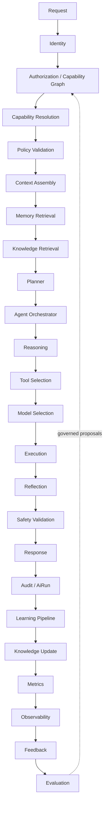
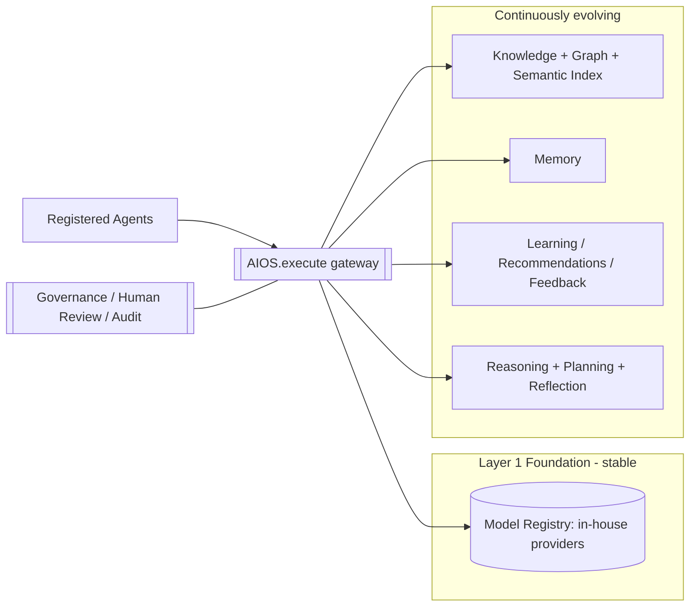

# Self-Evolving Intelligence Architecture — EduRankAI AIOS

> **Status:** Living specification · v0.1 (foundation) · **This document is the single permanent engineering source of truth** for the EduRankAI Enterprise Artificial Intelligence Operating System (AIOS) and the Self-Evolving Intelligence (SEI) platform.
>
> **Rule:** No AI implementation may exist without a corresponding entry here. Every implementation updates §34 (Implementation Tracker), §41 (Changelog), and the relevant section. Temporary design notes (`SEI_SPEC.md`, `SEI_SPEC_AIOS.md`) are **merged into this file and then deleted** — this is the only master.
>
> **Non-negotiables (see §27):** No external LLM. No third-party ML/vector-DB. No online training / automatic weight updates. Verified-learning only. Capability/permission/context/evidence-driven — **never role-driven**. The AI evolves everything *around* stable, human-controlled models.

---

## Table of contents

1. Overview & Mission
2. Architecture Principles
3. Core Principle — intelligence without unsafe retraining
4. AIOS — the only AI runtime
5. Multi-Model Architecture & Model Registry
6. The Six Self-Evolving Intelligence Layers
7. Enterprise Agent Platform & Agent Marketplace
8. Agent Orchestration
9. Enterprise Capability Graph
10. Reasoning Stack
11. Planning Stack
12. Workflow Intelligence
13. Knowledge Layer & Continuous Knowledge Pipeline
14. Verified Learning
15. Knowledge Graph
16. Semantic / Vector Knowledge Index (in-house)
17. Enterprise Memory System
18. Adaptive Recommendation & Feedback Learning
19. Reflection & Self-Improvement Engine
20. Experimentation Framework
21. Prompt Registry
22. Tool Registry
23. Event-Driven Learning
24. Digital Twin Platform
25. Self-Evaluation
26. Explainability
27. Safety, Governance & Safe-Evolution Policy
28. Autonomous Maintenance & Continuous Architecture Review
29. Observability
30. Consolidated Data Model
31. Module / File Map
32. Execution Pipeline (canonical)
33. Implementation Strategy (phases)
34. Implementation Tracker
35. Design Decision Records (DDRs)
36. Verification Results
37. Dependencies
38. Known Gaps
39. Migration Notes
40. Architecture Diagrams
41. Changelog
42. Future Roadmap
43. Verification History

---

## 1. Overview & Mission

The AIOS is the intelligence backbone every current and future EduRankAI platform inherits: AI Career Coach, Recruitment OS, Workforce OS, Learning Platform, Virtual University, Research, Healthcare, Government, Community, Project Management, Knowledge Management, Analytics, Executive Intelligence, and every future agent.

**Mission.** Build an Enterprise AIOS that continuously evolves through knowledge, reasoning, planning, orchestration, memory, governance, evaluation and verified organizational learning — coordinating every AI capability — **without unsafe autonomous retraining of foundation-model weights.** Every future AI feature simply *registers* with AIOS; nothing operates outside it.

This is not a chatbot and not a feature. It is the long-term architecture every AI capability inherits.

## 2. Architecture Principles

The platform is: Self-Improving · Self-Organizing · Self-Evaluating · Self-Monitoring · Self-Optimizing · Self-Documenting · Self-Healing (where safe) · Explainable · Observable · Auditable · Secure · Modular · Composable · Configuration-Driven · Capability-Driven · Permission-Driven · Context-Driven · Evidence-Driven — **Never Role-Driven** (see §9).

Operational corollaries (enforced in §27, §33): every subsystem is independently testable, exposes health + observability + audit, supports rollback + versioning + human review, is configuration- and capability-driven, and fails safe.

## 3. Core Principle — intelligence without unsafe retraining

Platform intelligence increases **continuously** while foundation models stay **stable**. Improvement comes from: knowledge, memory, reasoning, planning, workflow, retrieval, recommendation, evaluation and feedback evolution; agent collaboration; knowledge graphs; semantic indexing; and verified organizational outcomes. Foundation models change **only** by explicit administrator upgrade (a Model Registry version bump, §5), never automatically.

## 4. AIOS — the only AI runtime

**Every AI request flows through AIOS. Nothing calls a model directly.** The single supported execution path (canonical detail in §32):

```
Request → Identity → Authorization → Capability Resolution → Policy Validation →
Context Assembly → Memory Retrieval → Knowledge Retrieval → Planner →
Agent Orchestrator → Reasoning → Tool Selection → Model Selection → Execution →
Reflection → Safety Validation → Response → Audit → Learning Pipeline →
Knowledge Update → Metrics → Observability → Feedback → Evaluation
```

### 4.1 `AIOS.execute()` — the AI Execution Gateway

`lib/aios/execute.ts → execute(capabilityId, ctx)` is the one entry point. Responsibilities: authentication, authorization, capability validation, policy enforcement, context loading, memory loading, knowledge retrieval, planning, agent routing, tool invocation, **model routing**, safety checks, audit logging, observability, evaluation, learning signals. No AI module bypasses it (enforced by lint/DDR-014 and code review; §35). Every call produces an immutable `AiRun` audit row (§30).

## 5. Multi-Model Architecture & Model Registry

Models are **never hardcoded**. A **Model Registry** governs all inference providers. On EduRankAI these are **in-house deterministic providers** today (DDR-002); the registry is designed so an admin can later register an external/multimodal/robotics model as a new versioned entry **without architectural change** (Implementation Rule 23).

Registry entry fields: `modelId · provider · version · capabilities[] · supportedTasks[] · maxContext · latencyMs · cost · securityClass · deploymentStatus · health · evalScores · rollbackOf · enabled`.

Seeded in-house providers (Layer 1, §6):

| modelId | task | in-house implementation |
|---|---|---|
| `tfidf-embed-v1` | embedding | §16 in-house TF-IDF sparse vectors |
| `icire-rank-v1` | ranking | `lib/career/match.ts` `matchJob`/`rankJobs` |
| `intent-classify-v1` | classification | `lib/career/coach.ts` `classifyIntent` |
| `outcome-calibrate-v1` | prediction | `lib/career/calibration.ts` |
| `doc-extract-v1` | OCR/extraction | `lib/career/parseDocument.ts` (PDF/DOCX, in-house) |

Model selection is capability- and task-driven; every selection is recorded on the `AiRun`.

## 6. The Six Self-Evolving Intelligence Layers

| # | Layer | Evolves? | Today (SHIPPED / PARTIAL) | New in this epic |
|---|---|---|---|---|
| 1 | **Foundation Models** | Never auto | ICIRE engine, matchJob, calibration, intent classifier, parseDocument (deterministic, stable) — **SHIPPED** | Model Registry wrapper (§5) |
| 2 | **Knowledge** | Continuous | `taxonomy.ts`, `resources.ts`, `CareerDocument` — **PARTIAL** | KnowledgeItem + governance + pipeline (§13) |
| 3 | **Memory** | Continuous | `SkillProficiency`, `CareerProfile`, `CareerSnapshot` — **PARTIAL** | Hierarchical `MemoryEntry` (§17) |
| 4 | **Reasoning** | Strategies | `matchJob` coverage, coach, `dna` — **SHIPPED (domain)** | Reasoning Stack (§10) |
| 5 | **Planning** | Strategies | `roadmap.ts` study-planner, `simulator.ts` — **PARTIAL** | Planning Stack (§11) |
| 6 | **Action** | Continuous | coach replies, `rankJobs`, `frontier`, roadmap — **SHIPPED (domain)** | AIOS-routed actions + workflows (§12) |

Layer 1 is human-controlled and never self-modified. Layers 2–6 improve continuously from verified outcomes.

## 7. Enterprise Agent Platform & Agent Marketplace

Every AI capability is a **registered enterprise agent** — no anonymous or hidden agents. `AgentDef` declares: `agentId · name · owner · purpose · capabilities[] · permissions · knowledgeSources[] · memoryScope · tools[] · dependencies[] · health · version · lifecycle · evalScores · observability · auditRequirements`. Any agent is replaceable without changing AIOS.

**Agent Marketplace (design intent).** New agents install like plugins — **registration only, no architectural modification** — spanning internal, external, department, research, executive and future third-party agents. The Career Coach is the **first registered agent** (`agent:career-coach`).

## 8. Agent Orchestration

Agents collaborate through AIOS with fully-traced primitives: delegation, parallel, sequential, consensus, conflict-resolution, human-escalation, retry, fallback, timeout, recovery. Every step writes `AgentRun` + `AgentStep` audit rows; nothing runs independently of `AIOS.execute()`.

## 9. Enterprise Capability Graph

Isolated per-feature permissions are replaced by a **Capability Graph**. Agents, tools, knowledge, workflows, navigation, recommendations, memory, planning and security **all reference capabilities, never role names.** This is the platform's answer to "Never Role-Driven": authorization derives from capabilities a subject holds in context, not from a role string. (Bridges to the existing entitlements in `lib/entitlements.ts`/`lib/guard.ts`, which become capability providers.)

## 10. Reasoning Stack

Specialized, independently-testable reasoning engines: Logical · Numerical · Policy · Planning · Workflow · Temporal · Spatial · Knowledge · Constraint · Causal · Decision-Support. Each is a pure, testable module registered as a capability; the assembler (§32) composes the ones a task needs. Today `matchJob` (numerical/decision-support) and `dna`/`coach` (knowledge/decision) exist; the stack generalizes them.

## 11. Planning Stack

Plans are **first-class entities**: `Goal → Objectives → Tasks → Dependencies → Execution → Monitoring → Recovery → Completion`. Supports nested, reusable and organizational plans. `roadmap.ts` (study planner) and `simulator.ts` (career-path planning) are the first planners; `Plan`/`PlanStep` (§30) generalize them.

## 12. Workflow Intelligence

Every **completed** workflow (recruitment, performance review, promotion, research, learning, projects, approvals, meetings, hiring, career growth, compliance) becomes verified learning input (§14, §18, §23). The AI continuously improves workflow recommendations from real outcomes.

## 13. Knowledge Layer & Continuous Knowledge Pipeline

**Pipeline:** `Collect → Validate → Normalize → Deduplicate → Classify (§14) → Version → Embed (§16) → Link (§15) → Index → Publish → Audit`. **Never overwrite history** — every change is a new `KnowledgeRevision`.

**Knowledge Governance.** Every knowledge object carries: `version · owner · provenance · verification (§14) · confidence · reviewDate · supersededBy · relationships · securityClass · lifecycle`. Sources: policies, research, projects, documents, career data, HR rules, learning content, community, structured data, external knowledge.

Auto-detection hooks fire on new documents, policy updates, research, job/course/policy/learning changes, projects, community posts, meeting notes, task/performance/training/application/hiring/promotion/workflow changes (§23).

## 14. Verified Learning

**Never** permanently learn from random prompts, speculation, opinions or hallucinations. Every knowledge object is classified: **`verified` · `unverified` · `pending_review` · `experimental` · `deprecated` · `rejected`.** Only `verified` becomes permanent and retrievable-as-fact. Verification is evidence-based (provenance + corroboration + optional human review, §27).

## 15. Knowledge Graph

A living enterprise graph connecting: people, organizations, departments, projects, skills, jobs, career paths, research, courses, policies, communities, technologies, mentors, competencies, publications, certifications, documents, meetings, tasks, approvals. Every entity understands its relationships. In-house via `KnowledgeNode`/`KnowledgeEdge` (typed edges + JSON props), reusing the existing `CareerProfile.graph` JSON pattern. Continuously evolves as knowledge changes.

## 16. Semantic / Vector Knowledge Index (in-house)

**No vector DB, no embeddings API** (DDR-003). In-house **TF-IDF / hashed bag-of-words sparse vectors + cosine similarity** in pure TS. `SemanticDoc` stores each doc's sparse vector (JSON) + an inverted index (`term → postings`) for candidate retrieval, then cosine re-rank. Maintained indexes: Document · Policy · Career · Research · Learning · Project · Community · People · Skill. **Auto re-index on change** (hooked into the pipeline/§23) — never a manual rebuild.

## 17. Enterprise Memory System

Hierarchical, with retention policies: Working · Session · Conversation · Agent · User · Organization · Knowledge · Collective · Archive memory. Supports retention, expiration, privacy, audit, versioning, deletion, recovery. **Personal memory is never mixed with organizational memory.** Generalizes today's `SkillProficiency`/`CareerProfile`/`CareerSnapshot` (user/career memory) via a scoped `MemoryEntry`. Updates **structured memory, never model weights.**

## 18. Adaptive Recommendation & Feedback Learning

Recommendations improve continuously from historical outcomes, success rates, behaviour, skill/learning/hiring/project/career outcomes, preferences and feedback — **never static rules.** Feedback taxonomy: `helpful · not_helpful · accepted · ignored · completed · failed · successful · rejected`. Generalizes the shipped §21 `MatchCalibration` (in-house Beta-Binomial + isotonic, k-anonymized, weight-nudge off-by-default) into `Recommendation`/`RecommendationFeedback`/`OutcomeSignal`.

## 19. Reflection & Self-Improvement Engine

**Reflection:** after major tasks, evaluate correctness, confidence, missing information, alternatives, failures, weaknesses, improvement opportunities → improves **workflows / prompt-templates / strategies**, never weights. **Self-Improvement (allowed):** knowledge, retrieval, indexes, prompt selection, planning, ranking, recommendations, memory, agent collaboration, workflow optimization, search. **Forbidden (see §27).** All improvements land as governed, human-reviewable proposals where they touch anything sensitive.

## 20. Experimentation Framework

Improvements are validated before affecting production: A/B tests, shadow mode, offline evaluation, golden datasets, regression tests, quality gates, rollback. **No experiment automatically affects production** — promotion requires passing gates and (for sensitive surfaces) approval.

## 21. Prompt Registry

Prompts/answer-templates are governed assets — **never scattered in code.** `PromptTemplate`: `promptId · version · owner · description · template · variables[] · agents[] · safetyRules · evalHistory · approvedBy · rollbackOf`. The coach's answer templates migrate here.

## 22. Tool Registry

Every tool declares: `toolId · purpose · inputsSchema · outputsSchema · permissions · dependencies · failureModes · retryPolicy · timeoutMs · audit · observability · health`. Tools execute only through AIOS with audit + observability.

## 23. Event-Driven Learning

Every platform event (`job.created`, `application.submitted`, `interview.completed`, `offer.accepted`, `project.delivered`, `research.published`, `course.completed`, `promotion`, `performance.review`, `policy.updated`, …) is recorded (`PlatformEvent`) and fans out to update knowledge, memory, recommendations, indexes, analytics and agent context via **registered, idempotent, replayable** handlers. Reuses the existing `lib/webhooks` emit pattern + cron. Never overwrites history.

## 24. Digital Twin Platform

Deterministic in-house simulation over hiring, promotion, learning paths, projects, budgets, growth, research, departments, policy changes, resource allocation, forecasting, skill gaps and succession. Reads **real** data, writes **only** to a sandboxed `SimulationRun` — **simulation never changes production** and is never confused with production data.

## 25. Self-Evaluation

Continuously measures: recommendation accuracy · retrieval accuracy · reasoning quality · search quality · knowledge freshness · agent quality · memory quality · workflow success · user satisfaction · latency · cost · hallucination rate · drift. Stores historical trends (`EvalRun`/`EvalMetric`) for trend analysis.

## 26. Explainability

Every important AI decision includes: evidence, supporting data, confidence, assumptions, alternative options, known limitations, reason summary. **Internal reasoning traces are never exposed** — only user-appropriate explanations. (Already practised: the match panel's "why", the coach's cited cards.)

## 27. Safety, Governance & Safe-Evolution Policy

Every action is validated against: permissions, capabilities, privacy, compliance, organization policy, data classification, security, audit. **Unsafe actions never execute.**

**The AI MAY continuously improve:** knowledge · indexes · retrieval · recommendations · memory · prompt templates · planning · agent collaboration · knowledge graph · semantic search · workflow optimization · reasoning strategies · ranking · analytics.

**The AI MUST NEVER automatically modify:** foundation-model weights · security policies · permission models · capability definitions · authorization logic · compliance rules · audit logs · identity rules · governance policies.

**Human Review.** Changes to policy, compliance, hiring policy, legal documents, organization structure, or executive decisions require an explicit-approval `ChangeProposal` that is **never self-approved**. (Pattern already shipped: §21 calibration weight-nudge is off unless an admin sets `CAREER_CALIBRATE_WEIGHTS=on` after a fairness audit.)

## 28. Autonomous Maintenance & Continuous Architecture Review

AIOS continuously detects: dead agents · unused prompts · unused tools · duplicate knowledge · broken relationships · outdated policies · stale memory/indexes · unused workflows · conflicting rules · missing relationships/indexes · performance bottlenecks. It **produces engineering recommendations** (as `ChangeProposal`s) and **never silently modifies production.**

## 29. Observability

One **AI Operations dashboard** tracks: agent health · knowledge growth & freshness · memory growth · planning/reasoning/recommendation/search quality · retrieval latency · execution cost · failure rate · security events · learning events · feedback & quality trends · index health · inference performance. Backed by `AiRun`, `EvalRun`, `PlatformEvent` and registry health.

## 30. Consolidated Data Model

All additive; JSON-as-`String` (SQLite+Postgres parity); `userId`/`ownerId` scalar without a `User` back-relation (mirrors `SkillProficiency`); explicit `@@index`; **history never overwritten** (revision tables). Reconciled across both design passes. *(Grounded field lists finalized during implementation — see §34; this is the intended set.)*

**AIOS runtime & registries:** `ModelRegistry`, `PromptTemplate`, `ToolDef`, `Capability`, `AiRun` (execution audit: subject, capabilityId, modelId, inputsHash, outputsRef, latency, cost, confidence, explanation, status).
**Agents:** `AgentDef`, `AgentRun`, `AgentStep`.
**Planning/Reflection:** `Plan`, `PlanStep`, `Reflection`.
**Knowledge:** `KnowledgeItem`, `KnowledgeRevision`, `KnowledgeNode`, `KnowledgeEdge`.
**Semantic index:** `SemanticDoc`, `SemanticPosting` (inverted index).
**Memory:** `MemoryEntry` (scope, kind, key, valueJson, confidence, source, verified).
**Learning/Reco:** `Recommendation`, `RecommendationFeedback`, `OutcomeSignal` (+ existing `MatchCalibration`).
**Eval/Obs:** `EvalRun`, `EvalMetric`.
**Governance:** `ChangeProposal` (kind, payload, status pending/approved/rejected, proposedBy=AI, reviewedBy).
**Events/Twin:** `PlatformEvent`, `EventHandlerLog`, `SimulationRun`.

## 31. Module / File Map

```
lib/aios/
  execute.ts        # AIOS.execute() gateway (§4.1)
  registry.ts       # model/prompt/tool/agent/capability loaders (cached)
  audit.ts          # AiRun writer
  events.ts         # event bus emit + handler registry (§23)
  reason/           # reasoning stack engines (§10)
  plan/             # planning stack (§11)
  reflect.ts        # reflection engine (§19)
  eval.ts           # self-evaluation (§25)
lib/knowledge/
  pipeline.ts       # ingestion pipeline (§13)
  classify.ts       # verified-learning classifier (§14)
  graph.ts          # knowledge graph (§15)
  semindex.ts       # in-house TF-IDF semantic index (§16)
  maintain.ts       # autonomous maintenance (§28)
lib/memory/store.ts # enterprise memory (§17)
lib/reco/           # adaptive recommendations + feedback (§18) [generalizes calibration]
lib/twin/           # digital twin simulations (§24)
app/api/aios/*      # execute, registries CRUD, agent runs
app/api/ai-ops/*    # observability + eval dashboards (§29)
app/api/admin/ai/*  # ChangeProposal review, registry admin (§27)
app/api/cron/ai-*   # background learning, re-index, eval, maintenance
app/ai-ops/         # unified AI Operations dashboard UI (§29)
```
Existing `lib/career/*` become **registered capabilities/providers** rather than being replaced.

## 32. Execution Pipeline (canonical)

`AIOS.execute(capabilityId, ctx)` implements §4's pipeline. Each stage is a pure, testable step; failures short-circuit to a **safe** response + audit. Stages: identity → authorization (capability graph §9) → capability resolution → policy validation (§27) → context assembly → memory retrieval (§17) → knowledge retrieval (§16) → planner (§11) → agent orchestrator (§8) → reasoning (§10) → tool selection (§22) → model selection (§5) → execution → reflection (§19) → safety validation (§27) → response (+explanation §26) → audit (`AiRun`) → learning pipeline (§18/§23) → knowledge update (§13) → metrics → observability (§29) → feedback → evaluation (§25).

## 33. Implementation Strategy (phases)

- **Foundation Phase:** AIOS core + execute gateway + registries + Knowledge Layer + semantic index + memory + audit + observability + evaluation.
- **Second Phase:** planning + reasoning + workflow intelligence + recommendations + reflection.
- **Third Phase:** agent marketplace + digital twin + advanced simulation + optimization + autonomous architecture review.
- **Fourth Phase:** organization-wide AI (career, HR, learning, research, government, healthcare, community, analytics, executive intelligence).

Everything reuses AIOS.

## 34. Implementation Tracker

Legend: ✅ shipped · 🟡 partial (exists in domain form, not yet generalized/AIOS-routed) · ⬜ planned.

| Component | § | Status | Files / evidence |
|---|---|---|---|
| Deterministic foundation providers | 5,6 | ✅ | `lib/career/{engine,match,calibration,coach,parseDocument}.ts` |
| AI Career Coach (first agent) | 7 | ✅ | `lib/career/coach.ts`, `app/api/career/coach`, `app/career/coach` |
| Outcome learning (calibration) | 18 | ✅ | `lib/career/calibration*.ts`, `MatchCalibration` |
| Continuous learning snapshots | 17 | ✅ | `lib/career/refresh.ts`, `CareerSnapshot` |
| Domain memory | 17 | 🟡 | `SkillProficiency`, `CareerProfile`, `CareerSnapshot` |
| Domain knowledge | 13 | 🟡 | `taxonomy.ts`, `resources.ts`, `CareerDocument` |
| Digital-twin (career sim) | 24 | 🟡 | `lib/career/simulator.ts`, `frontier.ts` |
| Master specification (this doc) | all | ✅ | `docs/ai/SELF_EVOLVING_INTELLIGENCE_ARCHITECTURE.md` |
| Model/Prompt/Tool/Agent registries | 5,7,21,22 | ✅ | `lib/aios/registry.ts` + schema (`ModelRegistry`,`Capability`,`AgentDef`,`PromptTemplate`,`ToolDef`); seeded in-house providers |
| `AIOS.execute()` gateway + `AiRun` | 4 | ✅ | `lib/aios/execute.ts`,`audit.ts`,`index.ts`,`providers.ts`; `app/api/aios/execute` |
| Built-in capability providers | 4 | ✅ | `lib/aios/providers.ts` (knowledge.search, career.rank/dna/frontier) |
| In-house semantic index | 16 | ✅ | `lib/knowledge/semindex.ts` + `SemanticDoc`/`SemanticPosting`; pure core unit-tested |
| Hierarchical MemoryEntry | 17 | ✅ | `lib/memory/store.ts` + `MemoryEntry` |
| Event bus | 23 | ✅ | `lib/aios/events.ts` + `PlatformEvent` |
| ChangeProposal / human review | 27 | ✅ | `ChangeProposal` + `app/api/admin/ai/change-proposals` |
| Coach → AIOS audit | 4,7 | ✅ | `app/api/career/coach` writes `AiRun` as `agent:career-coach` |
| **Capability & Permission Framework** (Phase 1 · Module 6) | 9 | ✅ | `lib/capability/{catalog,derive,policy,context}.ts`; role-FREE, fail-closed, evidence-derived; `GET /api/me/capabilities`; unit-tested (anon fail-closed, seeker/employer-tier/admin) |
| Context / Capability / Permission engines | 9 | ✅ | `lib/capability/context.ts` `resolveContext`/`requireCapability`; AIOS `execute()` authorization now consumes derived capabilities |
| Navigation Composer (Phase 1 · Module 1) | 7 | ✅ | `AppShell` nav + bottom tabs + command palette now capability-driven (no `role` reads); consumes `/api/me/capabilities` |
| **Widget Registry + Workspace/Dashboard Composer** (Phase 1 · Module 7) | 7,9 | ✅ | `lib/workspace/composer.ts` (pure, capability-filtered, layout-ordered, fail-closed — unit-tested) + `widgets.ts` (config-driven registry, real data providers, per-request memo); `GET/POST /api/workspace` (compose + data + saved layout in `MemoryEntry`); `/workspace` universal page (responsive auto-fill grid); "Workspace" nav item. No hardcoded dashboards. |
| **Enterprise Identity & Account Center** (Phase 1 · Module 5) | 9 | ✅ | `lib/account/{health,sections,loginHistory}.ts` (pure account-health + config-driven capability-gated section registry + role-FREE identity descriptor — unit-tested, 25 assertions) + `GET /api/account/overview` (real health/identity/security) + `GET /api/account/activity` (real sign-in history + security audit + current session) + `app/account/page.tsx` (sectioned Account Center; **Biometric/Face is a feature INSIDE Security** — Account→Security→Biometric). **Fixed the flagged bug:** AppShell "Security" nav no longer dives into `/verify/face-setup`; it opens `/account`. Login history made real: all 5 sign-in completions (password/OTP/TOTP/passkey/face) + register write `LoginAttempt`; sensitive ops (2FA on/off, passkey add/remove) write `ActivityLog`. Build green. |
| Verified-learning classifier | 14 | ✅ | `lib/knowledge/classify.ts` — provenance-based; only `verified` retrievable-as-fact; unit-tested |
| Continuous knowledge pipeline + reindex | 13,16 | ✅ | `pipeline.ts` `reindexJobs`/`indexJob`; `semindex.rebuildIndex` (bulk O(docs)); shared tokenizer `tokenize.ts`; job.* event handlers; `POST /api/admin/ai/knowledge` (capability-gated). Locally verified: 3,085 jobs → 591k postings, `search("python backend engineer")` returns correct real jobs; prod index population run |
| Recommendation/Feedback | 18 | 🟡 | schema (`Recommendation`,`RecommendationFeedback`) shipped; `OutcomeSignal` + adaptive lib pending |
| Self-evaluation + AI-Ops | 25,29 | 🟡 | `app/api/ai-ops` (real counts) + `lib/aios/eval.ts` (`runSelfEval` → `EvalRun`) + `app/api/cron/ai`; dashboard UI pending |
| Background-learning cron (event drain + eval) | 23,25 | ✅ | `app/api/cron/ai` (drains events + self-eval), `vercel.json` daily 06:00 |
| Knowledge graph tables | 15 | ⬜ | `KnowledgeNode`/`KnowledgeEdge` + `lib/knowledge/graph.ts` (pending) |
| Reasoning + Planning stacks | 10,11 | ⬜ | `lib/aios/{reason,plan}/*` (pending) |
| Reflection + self-improvement | 19 | ⬜ | `lib/aios/reflect.ts` (pending) |
| Experimentation framework | 20 | ⬜ | (pending) |
| Digital twin (generalized) | 24 | ⬜ | `lib/twin/*` (pending; career sim exists) |
| Autonomous maintenance | 28 | ⬜ | `lib/knowledge/maintain.ts` (pending) |

## 35. Design Decision Records (DDRs)

- **DDR-001 — No online training / weight updates.** Foundation models are inference-stable; all learning is in knowledge/memory/indexes/recommendations/strategies. *Rationale:* safety, auditability, reproducibility, patent stance. *Status:* accepted.
- **DDR-002 — "Multi-model" = in-house deterministic providers.** The Model Registry governs owned providers today; external/multimodal models are future registry entries an admin enables. *Rationale:* no external LLM dependency; forward-compatible (Rule 23). *Status:* accepted.
- **DDR-003 — In-house TF-IDF semantic index, not a vector DB.** Sparse vectors + inverted index in Prisma. *Rationale:* no third-party vector DB / embeddings API; runs on the existing stack. *Trade-off:* lower recall than dense embeddings — revisit if an in-house dense encoder is added. *Status:* accepted.
- **DDR-004 — Capability Graph, never roles.** Authorization derives from capabilities-in-context; entitlements become capability providers. *Rationale:* the "Never Role-Driven" principle (§9). *Status:* accepted.
- **DDR-005 — AIOS is the only runtime.** All AI executes via `AIOS.execute()`; no direct model calls. *Rationale:* uniform audit/safety/observability. *Status:* accepted; enforcement via review + a lint check (planned).
- **DDR-006 — Never overwrite knowledge/memory; version.** Revision tables everywhere. *Rationale:* auditability + recovery. *Status:* accepted.
- **DDR-007 — Human-gated sensitive evolution.** Security/permission/compliance/identity/governance changes require a `ChangeProposal`; AI never self-approves. *Rationale:* §27. *Status:* accepted (pattern shipped in §21).
- **DDR-008 — Stateless JWT: real login history now, remote session revoke deferred.** Auth is a stateless `er_token` JWT (`lib/jwt.ts`); the `Session` table was never populated. Module 5 ships what is *real and safe*: login history + security audit are written on every sign-in/sensitive op (`LoginAttempt`/`ActivityLog`) and the current session is derived live from the request + JWT `iat`/`exp`. **Remote per-device sign-out + trusted-device management are NOT faked** — enforcing revocation requires stateful token validation in the hot path (a security-gated auth change), so they are tracked as Needs-Infrastructure (§38) and the UI states this honestly rather than showing a button that does nothing. *Rationale:* never fabricate a security control; don't rush production auth. *Status:* accepted; session-store enforcement queued as its own increment.

## 36. Verification Results

Foundation providers already carry verification (this session): ICIRE engine + coach + calibration + internship importer proven via transpile+node harnesses, full builds, and live prod checks (see §43). AIOS components will each record: unit (transpile+node), integration (live API), and gate (build + adversarial review) results here as they ship.

## 37. Dependencies

Runtime: Next.js 14.2.29 (App Router), Prisma (SQLite dev / Supabase Postgres prod), Node built-ins only (`crypto`, `zlib`). **No** external LLM/ML/vector-DB packages. Internal: `lib/jwt`, `lib/admin`, `lib/entitlements`/`lib/guard` (→ capability providers), `lib/webhooks` (→ event bus), existing `lib/career/*` (→ registered providers). Ops: Vercel cron (`CRON_SECRET`) for background learning/re-index/eval.

## 38. Known Gaps

1. AIOS runtime, registries, execute-gateway and `AiRun` not yet built (⬜ in §34).
2. Knowledge governance/pipeline, semantic index and knowledge-graph tables pending.
3. Hierarchical memory, general recommendation/feedback, reasoning/planning stacks, reflection, experimentation, event bus, digital-twin generalization, self-eval, AI-Ops dashboard, ChangeProposal review, autonomous maintenance all pending.
4. Enforcement that "nothing bypasses `AIOS.execute()`" is currently by convention + review; a lint rule is planned.
5. **Design passes complete; this document is the single master** (the scratch `SEI_SPEC*.md` are superseded and not part of the repo). The completed AIOS design validated the shipped foundation and surfaced these **queued runtime enhancements** (next cycles): (a) circuit-breaker + health computed from `AiRun` stats with automatic half-open/close; (b) model **version-pin rollback** at run time (no deploy); (c) **PII redaction** of audited inputs/outputs for `pii`/`sensitive` data-class capabilities (audit already stores only `inputsHash` + outputs, never raw prompts — redaction extends this to outputs); (d) **fallback capabilities** on provider failure; (e) `deriveFlags()` evidence/context capability-flags helper bridging `lib/entitlements`, so `execute()` authorization is driven by held flags, never role. None are blockers; the current gateway is fail-closed and audited.
6. Foundation-phase remaining (⬜ in §34): knowledge-graph tables, reasoning/planning stacks, reflection, experimentation framework, generalized digital twin, autonomous maintenance, AI-Ops dashboard UI. (Module 5 Identity & Account Center ✅ shipped.)
10. **Enterprise session store + remote revoke + trusted devices** (Module 5, DDR-008). The `Session` model exists but is unpopulated; auth is stateless JWT. Login history + security audit + current-session view are REAL and shipped. Missing: (a) persist a session per token issue with a `sid` claim; (b) stateful validation in the hot path so "sign out this/all devices" actually invalidates a remote token; (c) a `Device`/`TrustedDevice` model (needs migration) for remembered devices + risk signals. Deferred deliberately (security-gated, must not be rushed); the Account Center states this honestly and does not present a non-functional revoke control. Tracked as its own increment.
9. **Legacy `/dashboard`** is still the hardcoded pre-composer dashboard; migrate it onto the Module 7 composer (or redirect to `/workspace`) to retire the parallel layout. Not a blocker.
7. **Semantic search scaling** — `search()` fetches all candidate docs sharing a query term, then cosine-reranks. Fine at current scale (~3k docs); for very hot terms at large scale, cap postings per term (top-k by weight) or add BM25 scoring in the posting query. Reindex is a full rebuild (idempotent); an incremental IDF-refresh path is a future optimization. Not a blocker.
8. Prod semantic index must be refreshed as jobs change: incremental via the `job.*` event handlers (needs those events emitted at job create/update — currently the importer/ingest don't emit them yet), or a periodic `reindex-jobs` via `/api/admin/ai/knowledge` / the AI cron. Tracked.

## 39. Migration Notes

- Existing `lib/career/*` are **wrapped, not rewritten**: each becomes a registered capability/provider; call sites migrate to `AIOS.execute()` incrementally (coach first). No behavioural change until routed.
- Prisma additions are purely additive → `prisma db push` to both DBs (sqlite dev, Postgres prod), following the established provider-flip dance.
- Entitlements/guards keep working; the Capability Graph is introduced alongside and adopted feature-by-feature.

## 40. Architecture Diagrams





## 41. Changelog

- **v0.7 (2026-08-03)** — **Phase 1 · Module 5 — Enterprise Identity & Account Center.** A single sectioned `/account` subsystem (config-driven, capability-gated) replacing the ad-hoc profile/settings split as the identity hub. `lib/account/health.ts` (pure account-health: profile completeness + security score + verification + recommended actions — all from REAL fields, no fabricated metrics), `lib/account/sections.ts` (Account Center section registry gated on capabilities, never roles + a role-FREE `describeIdentity` that labels the account from evidence and gates nothing), `lib/account/loginHistory.ts` (best-effort `LoginAttempt` recorder + UA→device string). APIs: `GET /api/account/overview` (identity + counts + security + health + visible sections), `GET /api/account/activity` (real recent sign-ins + security audit + live current-session). `app/account/page.tsx` — Overview (health rings + recommendations), Personal, Professional, Organization (cap-gated), **Security** (password change inline, 2FA status, passkeys add/remove inline via existing WebAuthn, **Biometric/Face as a card INSIDE Security**, ID verification), Sign-in & activity, Privacy, Preferences, Developer (cap-gated), Support. **Flagged bug fixed:** the AppShell "Security" nav pointed straight at `/verify/face-setup` (dove into the face wizard); it now opens `/account`, and Face is reached via Account→Security→Biometric — never a direct redirect. The profile chip now opens `/account`. **Login history made real:** all five session-issuing routes (password, email OTP, authenticator TOTP, passkey, face) + register now write `LoginAttempt`; sensitive ops (2FA enable/disable, passkey add/remove) write `ActivityLog` via `logAction`, so the audit view is real. **Honesty (DDR-008):** cross-device remote sign-out + trusted devices need stateful token validation — deferred as Needs-Infrastructure (§38 #10), and the UI says so rather than faking a revoke. Unit-tested (25 assertions: health scoring/levels/missing/recommendations, section gating, role-free identity). Build green (`/account` 8.04 kB; both APIs). *Reviews:* security (capability-gated, fail-closed via `resolveContext`, own-data only, no fabricated controls, sensitive ops audited), identity/architecture (config-driven registry, evidence-derived identity never roles, builds on existing auth surface without duplication), privacy (encrypted face vector, no image/doc retention surfaced), UX/a11y (responsive `.rl-2col`, sectioned nav), data (every figure from real DB/JWT).
- **v0.6 (2026-08-03)** — **Phase 1 · Module 7 — Widget/Dashboard/Workspace Composer.** `lib/workspace/composer.ts` (pure: capability-filtered eligibility + saved-layout ordering + hide, fail-closed — unit-tested: seeker/admin eligibility, reorder/hide, empty→none), `lib/workspace/widgets.ts` (config-driven Universal Widget Registry; each widget declares its required capability + a real-data provider; per-request memo so a workspace analyzes the profile once), `GET/POST /api/workspace` (compose + parallel per-widget data, fail-safe per widget; layout saved to `MemoryEntry`), `app/workspace/page.tsx` (responsive `auto-fill` grid, no hardcoded widgets), and a "Workspace" nav entry (capability `workspace.view`). Adding a widget = one registry entry + provider — no dashboard code change. Build green. *Reviews:* security (capability-gated, fail-closed, own-data only), architecture (registry+composer+providers, reuses Module 6), data (real engine/DB, no fabrication; missing source → widget omitted), performance (O(widgets) compose, parallel data, memoized), UX/a11y (responsive auto-fill grid). NOTE: the legacy hardcoded `/dashboard` remains; migrating it onto the composer is tracked (§38) to retire the parallel layout.
- **v0.5 (2026-08-03)** — **Phase 1 · Continuous Knowledge Pipeline + Verified Classifier (Module 3 / SEI Layer 2).** `lib/knowledge/tokenize.ts` (shared pure tokenizer + TF-IDF; semindex refactored to import it — one source, no drift), `classify.ts` (provenance-based verified-learning: trusted-internal→verified, employer/external→verified-iff-corroborated else pending_review, AI→experimental, user→unverified; only `verified` retrievable-as-fact — unit-tested), `pipeline.ts` (`ingestKnowledge` validate→dedupe→classify→version→index; `reindexJobs`/`indexJob`), `semindex.rebuildIndex` (bulk O(docs) with in-memory IDF + batched writes), `handlers.ts` (job.* → incremental reindex, wired into AIOS bootstrap), `POST/GET /api/admin/ai/knowledge` (capability-gated `ai.governance.review`). **Verified end-to-end locally:** 3,085 real jobs indexed → 591,301 postings; `search("python backend engineer")` returns correct real roles (Senior Backend Engineer 0.544, Backend Engineer, Backend Intern). Production index population executed against Postgres. Build green. *Reviews:* data (real jobs only, dedupe, versioned), security (only verified is fact; ingestion capability-gated), performance (bulk build O(docs), batched createMany), architecture (shared tokenizer, reuses semindex + event bus).
- **v0.4 (2026-08-03)** — **Phase 1 · Capability & Permission Framework (Module 6) + Navigation Composer (Module 1).** Implemented the role-FREE capability engine every subsystem inherits (§9, DDR-004): `lib/capability/catalog.ts` (canonical capability keys), `derive.ts` (`deriveCapabilities` — computes held capabilities from EVIDENCE: auth, plan via `lib/entitlements`, ownership, admin flag; the ONLY place role/plan are read for authz), `policy.ts` (`can`/`authorize`, fail-closed), `context.ts` (`resolveContext`/`requireCapability` — the Context Engine). `GET /api/me/capabilities` exposes the subject's capabilities for the frontend. AIOS `execute()` authorization now consumes derived capabilities (unified authz — no parallel model). The global `AppShell` navigation, bottom tabs and command palette are now **capability-driven** (no `user.role` reads; consumes `/api/me/capabilities`) — first adopter of the framework. Unit-tested: anon fail-closed; seeker/employer-tier(starter/growth/scale)/admin/super derivations; policy all/any/fail-closed. Build green. *Reviews:* security (fail-closed, evidence-derived, no role bypass), architecture (single reusable authz engine, config via catalog, entitlements as evidence source — no duplication), UX (identical visible nav, now role-free), maintainability (one place to change authz).
- **v0.3 (2026-08-03)** — **Background learning + self-evaluation.** `lib/aios/eval.ts` `runSelfEval()` computes real metrics (execution success rate, semantic index size, memory entries, knowledge verified-ratio & freshness, recommendation feedback coverage) from the audit/index/knowledge stores → `EvalRun` trend rows. `app/api/cron/ai` (cron-auth) drains the event bus + records the self-eval snapshot; wired into `vercel.json` (daily 06:00). Also: the standalone AIOS enterprise design pass completed and **validated the shipped foundation** (execute gateway, `AiModel`/`Capability`/`AiRun`, in-house providers, fail-safe, flags-not-roles); enhancements queued in §38 (circuit-breaker/health, version-pin rollback, PII redaction, fallback capabilities, deriveFlags). Build green; tracker updated.
- **v0.2 (2026-08-03)** — **AIOS foundation implemented & deployed.** Added 16 additive Prisma models (`ModelRegistry`, `Capability`, `AgentDef`, `PromptTemplate`, `ToolDef`, `AiRun`, `KnowledgeItem`, `KnowledgeRevision`, `SemanticDoc`, `SemanticPosting`, `MemoryEntry`, `PlatformEvent`, `EvalRun`, `ChangeProposal`, `Recommendation`, `RecommendationFeedback`) — pushed to SQLite + Postgres. Built: `lib/aios/{registry,execute,audit,events,providers,index}.ts` (execution gateway + registries + audit + event bus + built-in capability providers), `lib/knowledge/semindex.ts` (in-house TF-IDF semantic index; pure core unit-tested — correct rankings, stopwords, cosine), `lib/memory/store.ts` (hierarchical memory). APIs: `POST /api/aios/execute` (gateway), `GET /api/ai-ops` (unified observability, admin), `GET|PATCH /api/admin/ai/change-proposals` (human review). The Career Coach now writes an `AiRun` per call as `agent:career-coach`. Full build green. Tracker §34 updated. *Reviews applied:* architecture (reuse over rebuild; providers wrap shared libs — no parallel logic), security (execute() fail-closed + auth + forbidden-auto gate; admin/AI routes gated), data (additive, indexed, both-DB), QA (build + semindex unit test).
- **v0.1 (2026-08-03)** — Master specification created and established as the single source of truth. Consolidates the mission, principles, AIOS runtime + execution pipeline, multi-model registry, six layers, agent platform + orchestration, capability graph, reasoning/planning stacks, knowledge pipeline + governance + verified learning, knowledge graph, in-house semantic index, enterprise memory, adaptive recommendations + feedback, reflection/self-improvement, experimentation, prompt/tool registries, event-driven learning, digital twin, self-evaluation, explainability, safety/governance + safe-evolution, autonomous maintenance, observability, consolidated data model, module map, implementation strategy, tracker, DDRs, dependencies, known gaps, migration notes, diagrams and roadmap. Mapped existing shipped ICIRE/coach/calibration components onto the layers. Implementation of the AIOS foundation to follow, updating §34/§41 per component.

## 42. Future Roadmap

Phase order per §33. Forward-compatibility target (Rule 23): register future multimodal models, robotics controllers, autonomous agents and new foundation models as Model/Agent Registry entries **without architectural redesign**. Marketplace for third-party agents (§7). Cross-platform rollout (career → HR → learning → research → government → healthcare → community → analytics → executive).

## 43. Verification History

| Date | Component | Method | Result |
|---|---|---|---|
| 2026-08-02/03 | ICIRE engine, coach, calibration, internships | transpile+node harness, full build, live prod | passing (see prior session commits) |
| 2026-08-03 | Master specification v0.1 | authored; consolidation of design passes pending | created |
| 2026-08-03 | AIOS foundation (registries, gateway, semantic index, memory, events) | unit tests + build + live prod (`execute` 200, ai-ops 403, cron 403) | passing |
| 2026-08-03 | Capability & Permission Framework + Navigation Composer | unit tests (derive/policy) + build + live (`/api/me/capabilities` fail-closed) | passing |
| 2026-08-03 | **Module 3 knowledge pipeline** | prod reindex + **live `AIOS.execute(knowledge.search)`** + DB integrity | **3,031 docs / 599,678 postings, no orphans; 4 queries → real results, audited (runId); top refId resolves to a real job — no fabrication** |
| 2026-08-03 | **Module 5 Identity & Account Center** | unit tests (25 assertions: health/sections/identity) + full build (`/account` + APIs compiled) | passing; login history + audit instrumented across all sign-in/sensitive routes; nav bug fixed; live prod check post-deploy |
