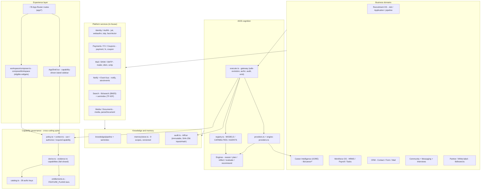
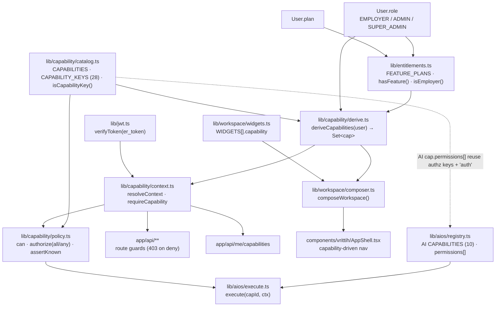

# Enterprise Capability Architecture

> **Master blueprint for the EduRankAI ecosystem — the capability model every current and future module inherits.**
> Architecture first: nothing is implemented outside this map. Never overwrite — always merge.
>
> Status: v0.1 · authored 2026-08-03 (grounded in the live repository).

## 1. Enterprise Capability Map

Vrittih is not organized as a set of role-locked "apps." It is a **single capability-addressable platform**: every route, nav item, dashboard widget, and AI provider references a *capability key*, and a subject's key-set is **derived from evidence** (authentication, plan, ownership, admin flag) rather than assigned by role. This is the architectural spine that lets one codebase serve seekers, employers, HR ops, recruiters, partners, and admins without per-persona forks. The canonical statement of that spine is `lib/capability/derive.ts` — deliberately the *only* place in the platform where `role`/`plan` are read for authorization (DDR-004).

Two facts about "capability" must be stated up front because the word is overloaded across two registries:

- **Authorization capabilities** — `lib/capability/catalog.ts`, **28 keys** in 12 `CapabilityGroup`s (`platform.access` … `admin.super`). These gate *access* to surfaces.
- **AIOS capabilities** — `lib/aios/registry.ts`, **10 `capId`s** (`knowledge.search`, `career.rank`, `career.dna`, `career.frontier`, `career.coach.answer`, `reasoning.infer`, `planning.plan`, `reflection.reflect`, `evaluation.evaluate`, `recommendation.rank`). These name *cognitive services* the AIOS gateway can execute.

They intersect through exactly one bridge: the authz key `ai.execute` guards the gateway `execute.ts`, which then re-checks each AIOS capability's own `permissions` (`["auth"]`) via `policy.authorize`. **Any doc, nav, or agent config must qualify which "capability" it means** — the two are separate namespaces that happen to share a word.

The platform stacks into six layers. Everything below is in-house (no third-party libs — patent posture): the "models" in `lib/aios/registry.ts` are deterministic providers (DDR-002), the vector index is our own TF-IDF (`lib/knowledge/semindex.ts`), auth crypto is hand-rolled (`lib/webauthn.ts`, `lib/totp.ts`, `lib/dkim.ts`).



Two edges in that diagram are aspirational and must be read as such:

1. **`DOM --> Gate` is partial.** `lib/aios/providers.ts` wraps the career libs (`career.rank` → `lib/career/match`, `career.dna` → `lib/career/dna`, `career.frontier` → `lib/career/frontier`), but the feature routes under `app/api/career/*` still call those libs **directly**, bypassing `execute()` — so they skip the safe-evolution gate, `AiRun` audit, and event emission. The gateway migration is genuinely incomplete (flagged in the providers file itself). This is the single highest-leverage refactor in the AI layer: routing domain calls through the gateway is what turns per-feature AI into a *governed, audited, self-improving* substrate.
2. **`Der --> Ent` is the whole monetization contract.** `FEATURE_PLANS` in `lib/entitlements.ts` is the only tier ladder (`emp_starter` 49 < `emp_growth` 149 < `emp_scale` 349; `network` also on individual `pro`), and `hasFeature()` is consumed by `derive.ts` to mint plan-gated caps. Any new paid domain must add a `Feature`, a `FEATURE_CAP` row, and a catalog key — in that order — or it will be invisible to both the UI (which hides on caps) and the API (which enforces on caps).

---

## 2. Business Capability Model

Status legend: **Shipped** = routes + models + libs present and wired to the capability spine · **Partial** = a real subset is built but the domain is not whole · **Planned** = no material implementation (at most a naming hook). Capability keys in `code` are real (`catalog.ts` authz keys or `registry.ts` AIOS `capId`s); other citations are real files/models.

### 2.1 Foundation — identity, authorization, cognition, knowledge

| Domain | Purpose | Key capabilities (real) | Dependencies | AI opportunities | Status in Vrittih today |
|---|---|---|---|---|---|
| **Identity** | One canonical person/company record across every surface | `User`, `Company`, `Profile`, `IdentityVerification`, `FaceVectorHistory`; `lib/faceVector.ts`, `lib/social/verify.ts` | AuthN | Entity resolution / dedupe across Indeed imports via `semindex` cosine; liveness scoring on `faceVector` | **Shipped** |
| **AuthN** | Prove who the subject is, passwordless-first | `lib/jwt.ts` (`er_token`), `lib/webauthn.ts` (passkeys), `lib/totp.ts` (RFC 4226/4648), `lib/otpStore.ts`; `app/api/auth/*` | Identity | Anomaly detection on `LoginAttempt`/`Session` via `reason.infer` rules | **Shipped** — fully in-house crypto |
| **AuthZ** | Grant access by derived capability, never role | `lib/capability/{catalog,derive,policy,context}.ts` (28 keys); `app/api/me/capabilities` | AuthN, Entitlements | `reason.infer` to *explain* why a cap was granted/denied (audit-grade rationale) | **Shipped** — canonical spine (DDR-004) |
| **Security** | Self-service protection of the account | `security.manage`; `Session`, `LoginAttempt`, `WebAuthnCredential`; `lib/ratelimit.ts`, `lib/guard.ts` | AuthN | Risk-scored step-up auth via `evaluate.evaluate` rubric on device/session signals | **Shipped** |
| **AIOS** | Governed gateway for all machine cognition | `ai.execute`/`ai.ops.view`/`ai.governance.review`; `lib/aios/{execute,registry,index}.ts`; `ChangeProposal`, `AiRun` | AuthZ, Knowledge, Memory | It *is* the AI opportunity surface — the win is migrating domain routes onto `execute()` | **Shipped** (gateway live) / **Partial** (route adoption) |
| **Knowledge** | Ingest → dedupe → classify → version → index real content | `knowledge.search`; `lib/knowledge/{pipeline,semindex,classify,tokenize}.ts`; `KnowledgeItem`, `KnowledgeRevision`, `SemanticDoc`, `SemanticPosting` | AIOS | Auto-classification (`classify.ts`) upgraded with `intent-classify-v1`; drift detection on revisions | **Shipped** — in-house TF-IDF, no external vector DB |
| **Search** | Rank any corpus (jobs, users, knowledge) | `lib/search.ts` (field-weighted BM25-ish), `lib/knowledge/semindex.ts`; `app/api/search`, `app/api/users/search` | Knowledge | Hybrid BM25 + TF-IDF fusion; learning-to-rank via `recommend.rank` `calibrateWeights` | **Shipped** |
| **Notification** | Deliver + broadcast platform events to people | `Notification`; `lib/notify.ts`; `app/api/notifications`, `app/api/admin/broadcast` | Event bus | Priority/salience ranking of a user's notification queue via `recommendation.rank` | **Shipped** |
| **Document** | Capture, parse, and extract from user files | `CareerDocument`, `ApplicationDocument`, `MediaAsset`; `lib/media.ts`, `lib/career/parseDocument.ts`, `lib/resume/parse.ts`; `doc-extract-v1` | Media, Knowledge | `doc-extract-v1` → structured entities into `SkillProficiency`; contract/clause extraction reuse for Legal | **Partial** — parsing + extraction exist; no generic DMS (folders/ACL/versioning beyond `KnowledgeRevision`) |
| **Reporting** | Turn platform data into decision artifacts | `app/analytics`, `app/api/admin/stats`; `lib/analytics.ts`; `AnalyticsEvent` | Analytics | Natural-language report generation from `AnalyticsEvent` via `reason.infer` + `evaluate.evaluate` | **Partial** — fixed dashboards/stats; no report builder |
| **Analytics** | Capture behavioral + funnel telemetry | `AnalyticsEvent`, `Activity`, `ActivityLog`; `lib/analytics.ts`; `app/api/analytics/*` | Event bus | Funnel anomaly + cohort insight surfacing; feeds `calibrateWeights` outcome signals | **Partial** — capture + display; no self-serve exploration |

### 2.2 Talent & Work — the operating core

| Domain | Purpose | Key capabilities (real) | Dependencies | AI opportunities | Status in Vrittih today |
|---|---|---|---|---|---|
| **Recruitment OS** | Post, source, and move candidates to hire | `jobs.post`, `candidates.view`, `pipeline.manage`, `company.manage`; `Job`, `Application`, `StatusEvent`, `EmployerGuarantee`; `app/dashboard/{post-job,recruiter,pipeline}` | Identity, Search, AIOS | `career.rank` (`icire-rank-v1`) for candidate↔job fit; `outcome-calibrate-v1` hiring-probability on the pipeline | **Shipped** |
| **Career Intelligence (ICIRE)** | Personal, in-house career engine (DNA, match, roadmap, frontier, sim) | `career.coach`, `career.intelligence`, `resume.build`; AIOS `career.dna`/`career.rank`/`career.frontier`/`career.coach.answer`; `lib/career/*`; `CareerProfile`, `CareerSnapshot`, `MatchCalibration` | AIOS, Knowledge, Memory | The flagship — route it through `execute()` for auditable `AiRun`s; `recommend.rank` calibrated on `RecommendationFeedback` | **Shipped** (Phases 1–6) / **Partial** gateway routing |
| **Learning** | Point users at the skills their frontier demands | `career.intelligence`; `app/learn`; `lib/career/resources.ts` | Career Intelligence | `plan.plan` (STRIPS BFS) to sequence a learning path from current → target `SkillProficiency` | **Partial** — curated resources only; no courses/enrollment/LMS |
| **Workforce OS** | Run the company's people operations | `hrms.view`, `payroll.view`, `tasks.view` | Identity, Finance | Attrition risk via `evaluate.evaluate`; shift/leave optimization via `plan.plan` | **Partial** — the three sub-domains ship; no onboarding/org-chart/performance module |
| **HRMS** | Employee master, attendance, leave | `hrms.view`; `Employee`, `Attendance`, `LeaveRequest`; `app/hrms`, `app/api/hrms/*`, `app/api/v1/employees` | Identity | Leave-pattern anomaly detection; auto-approval policy via `reason.forwardChain` rules | **Shipped** (Growth tier) |
| **Payroll** | Compute compensation and payslips | `payroll.view`; `Compensation`, `PayrollRun`, `Payslip`; `lib/payroll.ts` | HRMS, Finance | Payroll variance explanation via `reason.infer` | **Shipped** as an **engine** — explicitly *not* a statutory-compliance product (per `schema.prisma` comment) |
| **Tasks** | Assign and track units of work | `tasks.view`; `Task`; `app/tasks`, `app/api/v1/tasks` | Workforce OS | Auto-prioritization/assignment via `recommendation.rank` | **Shipped** (Growth tier) |
| **Projects** | Group tasks into deliverables/milestones | (closest: `Task`) | Tasks | Critical-path + risk via `plan.plan` dependency edges | **Planned** — no `Project` model; Tasks are flat |
| **Assessments / Exams** | Author and score tests | `Test`, `Question`, `TestAttempt`, `Answer`; `app/tests/*`, `app/api/tests/[id]/{attempt,submit}` | Identity | Auto-item-generation + rubric grading via `evaluate.evaluate`; proctoring via `faceVector` | **Shipped** |
| **Interviews** | Schedule and host structured interviews | `interviews.host`; `Interview`, `InterviewParticipant`; `lib/ical.ts` (RFC 5545); `app/interviews/[code]` | Communication, Calendar | Interview-question generation + scorecard synthesis via `evaluate.evaluate` | **Shipped** (Scale tier) |
| **Community** | Professional feed, network, spaces, pages, channels | `network.access`; `Post`, `Connection`, `Channel*`, `JobCommunity*`, `ProfessionalSpace*`, `ProfessionalPage*` | Identity, Search | Feed ranking + connection suggestion via `recommendation.rank`; `semindex` people-match | **Shipped** (Pro/Growth/Scale) |
| **Communication (Mail)** | First-party sending domains + mail | `mail.send`; `EmailDomain`, `Mail`, `Message`, `Conversation`; `lib/mailer.ts`, `lib/dkim.ts` (in-house RSA-2048), `lib/smtp.ts` | Identity | Draft/sequence generation; reply-intent via `intent-classify-v1` | **Shipped** (Scale tier) — in-house DKIM |

### 2.3 Growth & Revenue

| Domain | Purpose | Key capabilities (real) | Dependencies | AI opportunities | Status in Vrittih today |
|---|---|---|---|---|---|
| **CRM** | Contacts, deals, forms, outreach | `crm.view`, `mail.send`; `Contact`, `Activity`, `ContactMessage`, `Form`, `FormSubmission`; `lib/crmMeta.ts`; `app/contacts/*`, `app/forms/*` | Communication, Identity | Lead scoring + next-best-action via `recommendation.rank`; form-response classification | **Shipped** (Scale tier) |
| **Finance** | Charge, price, and reconcile revenue | `Coupon`, `CouponRedemption`; `lib/payment.ts` (`JOINING_FEE_CHF`), `lib/pricing.ts`, `lib/plans.ts`, `lib/fx.ts` (live rates, CHF base), `lib/razorpay.ts` | Entitlements | Churn/expansion prediction from plan events via `outcome-calibrate-v1` | **Partial** — billing/pricing/FX/coupons only (revenue side); no GL/AP/AR/invoicing. **CHF-only** per project rule |
| **Marketplace** | Two-sided matching of supply and demand | `jobs.browse/apply/save` + `jobs.post`; `Job`, `SavedJob`, `Application`, `JobSource`; `lib/sources/*`, `lib/ingest.ts` | Recruitment, Search | The job marketplace is the live two-sided market; `career.rank` powers both sides | **Partial** — job marketplace shipped; no app/extension/services marketplace |

### 2.4 Extensibility & platform reach

| Domain | Purpose | Key capabilities (real) | Dependencies | AI opportunities | Status in Vrittih today |
|---|---|---|---|---|---|
| **Partner / White-label** | Resell Vrittih under a partner brand + domain | `PartnerDomain`, `PartnerBrand`; `lib/brand.ts`, `lib/partnerVerify.ts`; `app/site/[host]`, `app/api/v1/*`, `app/admin/partners` | AuthZ, Entitlements | Per-tenant config recommendations; usage-based tier suggestions | **Shipped** (all phases per memory) |
| **Developer** | Issue keys, consume the platform programmatically | `api.keys`; `ApiKey`; `app/developers`, `app/api/keys` | AuthZ | Anomalous key-usage detection; auto-generated SDK/docs from route inventory | **Shipped** (Scale tier) |
| **API** | Stable partner/programmatic surface | `Webhook`, `WebhookDelivery`; `app/api/v1/{employees,payroll,tasks}`; `lib/webhooks.ts` | Developer, Integration | Endpoint anomaly + rate-shaping via `reason.infer` | **Shipped** |
| **Integration** | Connect external systems inbound/outbound | `lib/sources/{feed,selftest}.ts` (DB-free feed ingest), `Webhook*`; `app/api/cron/ingest` | API, Automation | Auto-mapping of arbitrary feeds to `Job` schema via `doc-extract-v1` + `classify.ts` | **Partial** — feed ingest + webhooks; no connector catalog/OAuth-app hub |
| **Automation** | Run work on schedules and events | `BackgroundJob`; `lib/jobHandlers.ts`, `lib/aios/events.ts` (`emit`/`on`/`process`/`drain`); `app/api/cron/{worker,ingest,ai,calibrate}` | Event bus, AIOS | `plan.plan`-driven workflow synthesis; idempotent event-handler generation | **Partial** — event bus + crons + job queue exist; no user-facing workflow builder |
| **Executive Intelligence** | Compose a role-aware command view of the org | `dashboard.compose`, `workspace.view`; `lib/workspace/composer.ts`, `lib/workspace/widgets.ts`; `app/workspace` | Analytics, Capability spine | `reason.infer` narrative briefings over composed widgets; `recommendation.rank` widget selection | **Partial** — capability-driven composer + analytics; no dedicated exec cockpit |

### 2.5 Not yet built (enterprise domains named in the target model)

These are legitimately **Planned** — no material models/routes today. The point of listing them is to show the seams where the existing spine already reaches.

| Domain | Purpose | Nearest existing hook | Dependencies | AI opportunities | Status |
|---|---|---|---|---|---|
| **ERP** | Unified resource/finance/ops backbone | Finance (billing) + Workforce OS are the seeds | Finance, HRMS | Cross-module `reason.forwardChain` policy engine | **Planned** |
| **Procurement** | Purchase requests → POs → vendors | none | Finance, ERP | Vendor scoring + spend anomaly via `recommendation.rank` | **Planned** |
| **Asset** | Track physical/IT assets and lifecycle | `MediaAsset` (digital media only — *not* asset mgmt) | HRMS, ERP | Predictive maintenance via `evaluate.evaluate` | **Planned** |
| **Legal** | Contracts, clauses, matters | `ChangeProposal.kind` includes `legal` (governance category only) | Document | Clause extraction/redline reusing `doc-extract-v1` | **Planned** |
| **Compliance** | Statutory obligations + evidence | `ChangeProposal.kind` `compliance`; payroll is explicitly *not* a compliance product | Legal, Audit (`AiRun`) | Obligation tracking + control testing via `evaluate.evaluate` | **Planned** — thin governance hook only |
| **University / Admissions / Student** | Institutional student lifecycle (EduRankAI heritage) | **Exams shipped** (`Test`/`Question`/`TestAttempt`); no student/admission models | Identity, Assessments | Admissions fit-ranking via `icire-rank-v1`; `career.dna` for student profiling | **Planned** (Exams sub-domain shipped) |
| **Alumni** | Post-graduation network + engagement | `Connection`/Community graph is the substrate | Community, Identity | Alumni-to-opportunity matching via `career.rank` | **Planned** |
| **Digital Twin** | Live simulatable model of a person/org | `CareerSnapshot` + `career.dna` + `lib/career/simulator.ts` are a **person-twin seed** | Career Intelligence, Knowledge | Scenario simulation via `plan.plan` over the twin state | **Planned** (career-twin primitives exist) |

**Architect's read.** The platform is deep on the *talent-and-work core* and its *governance/AI substrate*, and deliberately thin on the classic back-office ERP suite. The two moves that matter most are structural, not additive: (1) finish `DOM → execute()` gateway adoption so every domain's AI inherits audit (`AiRun`), safe-evolution, and calibration for free; and (2) treat `entitlements.ts` `Feature` + `catalog.ts` key + `FEATURE_CAP` as the *only* sanctioned way to introduce a new domain, so every "Planned" row above lights up through the same evidence-derived spine rather than growing a parallel authz path.

Grounding files: `lib/capability/{catalog,derive,policy,context}.ts`, `lib/entitlements.ts`, `lib/aios/{execute,registry,providers,engine-providers,reason,plan,reflect,evaluate,recommend,events,audit}.ts`, `lib/knowledge/{pipeline,semindex,classify}.ts`, `lib/memory/store.ts`, `lib/workspace/composer.ts`, `lib/career/*`, `prisma/schema.prisma` (verified model set).

## 3. Application (Platform) Capability Model

Vrittih is built as a set of **shared platform services** that every business module (jobs, HRMS, CRM, career, community, admin) consumes rather than re-implements. The doctrine is four invariants: (1) each service has exactly **one canonical entrypoint** — a module never opens a second path to the same concern; (2) all authorization flows through the **capability model** (`lib/capability/*`), never a role or plan read at the call site; (3) all AI flows through the **AIOS gateway** `execute()` (`lib/aios/execute.ts`, DDR-005) — never a direct model/provider call; (4) best-effort services (analytics, audit, events, notifications) **must never throw into the request path**. The table below states, per service, what exists today (with file citations), the target contract, and the consumption rule that keeps modules honest. Status tags follow the classification: **reusable** (canonical, consume as-is), **partial** (contract exists but incomplete), **needs-refactor** (works but the consumption path is inconsistent or a scale risk), **legacy-overlap** (a duplicate path that should collapse into the canonical one).

| Service | What exists today (files) | Target contract | Consumption rule | Status |
|---|---|---|---|---|
| **Identity** | `lib/jwt.ts` (`er_token` sign/`verifyToken`), passkeys `lib/webauthn.ts`+`webauthn-client.ts`+`cbor.ts`, 2FA `lib/totp.ts` (RFC 4226/4648), `lib/otpStore.ts`, face/doc `lib/faceVector.ts`+`lib/social/verify.ts` (`IdentityVerification`). Routes `app/api/auth/*`, `app/verify/*`. Resolution funnels through `lib/capability/context.ts` `resolveContext` (`er_token`→`verifyToken`→`prisma.user`). | One identity resolver that returns `{ user, caps }` for any request; all auth factors (password, passkey, TOTP, OTP, face/doc) hang off it; no route parses the cookie itself. | Call `resolveContext(req)` / `requireCapability(req, key)` — never `req.cookies.get("er_token")` + `verifyToken` inline in a feature route. | reusable |
| **Search** | Two engines: keyword `lib/search.ts` (`tokenize`/`scoreFields`/`rank` — BM25-lite, SQL pre-filter then rank in TS, prefix credit + coverage penalty); semantic `lib/knowledge/semindex.ts` (persisted TF-IDF over `SemanticDoc`/`SemanticPosting`, pure `rank()` reference + DB-backed idf). Routes `app/api/search`, `app/api/users/search`. | Keyword search for structured entity lists; semantic index for knowledge/document retrieval, exposed as AI cap `knowledge.search`. | Structured lists: cheap SQL OR-contains → `rank(items, qTokens, fieldsOf, take)`; never load-everything scans. Semantic: go through `execute("knowledge.search")`, not raw `semindex`. | reusable |
| **Notifications** | `lib/notify.ts` `createNotification({userId,title,body,link,sendEmail})` → `Notification` row (+ optional branded email via `lib/smtp`); fan-out handlers `notification.create` / `notification.broadcast` in `lib/jobHandlers.ts`. Routes `app/api/notifications`, `app/notifications`; admin `app/api/admin/broadcast`. | Single dual-channel (in-app + email) primitive; broadcasts go async through the queue. | Single recipient → `createNotification()`; many → `enqueue("notification.broadcast", {userIds,…})`. Never `prisma.notification.create` directly in a feature route. | reusable |
| **Messaging** | Models `Conversation`/`ConversationParticipant`/`Message`; routes `app/api/messages/*`, `app/messages`. No `lib/messaging` — send/read/participant logic is embedded in the route handlers. | A messaging service (`sendMessage`, `thread`, participant guards, read receipts) that routes call, mirroring `notify`. | Today: direct Prisma in routes (flagged). Target: extract to a service and consume that. | needs-refactor |
| **Documents** | Résumé parse `lib/resume/parse.ts`; career-doc parse `lib/career/parseDocument.ts`; models `ApplicationDocument`, `CareerDocument` (private analysis inputs). Media kinds `document`/`career_doc` in `lib/media.ts`. | Document = validated blob (Media) + a domain row + a parse pipeline; `career_doc` is owner-private, never shared to recruiters. | `validateUpload` → store `MediaAsset` → link the domain doc row → parse. `career_doc` served **owner-only** by `app/api/media/[id]`. | reusable |
| **Media** | `lib/media.ts` — `MEDIA_RULES` per kind (`avatar`/`logo`/`photo`/`cover`/`resume`/`document`/`career_doc`, mime + `maxBytes`), `validateUpload`, `parseDataUrl`; client-side `lib/clientImage.ts` resize; `lib/qrcode.ts`. Routes `app/api/upload`, `app/api/media/[id]`. | Server is the validation source of truth even though the client pre-resizes; per-kind mime/size policy in one map. | Always `validateUpload(kind, mime, size)` **server-side** before persisting; never trust client-reported size. Add a new asset type by extending `MEDIA_RULES`, not a new upload path. | reusable |
| **Analytics** | `lib/analytics.ts` — `track(name, props, userId)` (swallows all errors) + `summary(days)` (groupBy name, active users, per-day series) over `AnalyticsEvent`. Routes `app/api/analytics/*`. Domain trail: `Activity`/`ActivityLog`. | Durable, best-effort event stream that can never break a request path; `summary()` powers dashboards. | Fire-and-forget `track()` — never `await` it in a way that can fail the handler (it already swallows). Read via `summary()`. | reusable |
| **Permissions / Capabilities** | `lib/capability/{catalog,derive,policy,context}.ts` — 28 role-FREE keys in 12 groups; `deriveCapabilities(user)` is the **only** place role/plan are read (fail-closed); `can`/`authorize`/`assertKnown`; `requireCapability` guard. Tiers in `lib/entitlements.ts` (`FEATURE_PLANS`, `FEATURE_CAP`). Exposed at `app/api/me/capabilities`. **Overlap:** `lib/guard.ts` `requireFeature` re-checks `plan` directly via `hasFeature`. | Every access decision is a capability check; role/plan are *evidence* consumed once in `derive.ts`, nowhere else. | Guard routes with `requireCapability(req, key)` / `authorize(caps, keys, "all"|"any")`. Do **not** branch on `user.role`/`user.plan` in feature code. Migrate `guard.ts` `requireFeature` callers onto the capability keys (`FEATURE_CAP` already maps them). | reusable core + legacy-overlap (`guard.ts`) |
| **Workflow** | Durable queue `lib/jobs.ts` — `enqueue`/`registerHandler`/`processOnce`/`drain`/`queueStats`, priority, exponential backoff `[1,5,15,60,300]s`, stale-lock reclaim (2min), dead-letter; handlers in `lib/jobHandlers.ts`; `BackgroundJob` model; crons `app/api/cron/worker`, `app/api/internal/jobs/tick`. Event bus `lib/aios/events.ts` — `emit`/`on`/`process`/`drain` over `PlatformEvent` (idempotent, replayable). Pipeline transitions `StatusEvent`. | Two complementary primitives: **queue** for deferred/retryable work; **event bus** for domain-event fan-out into knowledge/memory/recommendations. | Deferred/retryable work → `enqueue(type, payload)` with a registered idempotent handler. Domain facts that should teach the system → `emit(type, payload, {actorId,subjectId})`. Never spin an ad-hoc `setTimeout`/inline retry. | reusable |
| **Calendar / Scheduling** | `lib/ical.ts` — in-house RFC 5545 (`icsDate`, 75-octet line folding, `buildICS`, `interviewToEvent`), Google/Outlook deep-links, subscribable token feed. Routes `app/api/calendar/[token]`, `app/api/me/calendar`, `app/api/interviews/[id]/ics`. `Interview`/`InterviewParticipant`. | No external calendar API/keys; a `.ics` that imports anywhere + a sync feed. | Build events via `interviewToEvent` → `buildICS`; expose per-user sync via the token feed. Do not hand-roll ICS strings elsewhere. | reusable |
| **Reports** | `summary()` (analytics), `queueStats()` (queue depth), admin aggregates in `app/api/admin/stats`, career `app/api/career/progress`/`dashboard`. No unified reporting layer — each surface runs its own `groupBy`. | A reporting service over `AnalyticsEvent` + domain models (saved report defs, ranges, exports). | Today: `summary()` for analytics dashboards; domain `groupBy` in admin routes. Target: route all aggregates through a reporting module. | partial |
| **Knowledge** | `lib/knowledge/pipeline.ts` (ingest→dedupe `contentHash`→classify→version→index; `reindexJobs`/`indexJob` over real active jobs), `semindex.ts` (persisted TF-IDF, DDR-003), `classify.ts`, `tokenize.ts`, `handlers.ts`. | One ingestion pipeline; retrieval only via AI cap `knowledge.search`; no external vector DB. | Ingest through `pipeline` (never write `SemanticDoc`/`SemanticPosting` directly); query through `execute("knowledge.search")`. | reusable |
| **Memory** | `lib/memory/store.ts` — `setMemory`/`getMemory`/`forgetMemory`/`exportMemory`, 9 scopes (`working…archive`), versioned upsert, TTL, `MemoryEntry`; privacy export/delete. | Hierarchical, structured (never model weights); personal (user/session) memory never mixed with org/collective. | Always pass explicit `scope` + `ownerId`; keep personal out of `org`/`collective`; honor GDPR via `forgetMemory`/`exportMemory`. | reusable |
| **AI (via AIOS)** | Gateway `lib/aios/execute.ts` `execute(capId, ctx)`: capability resolution → safe-evolution gate (`forbidden-auto` never auto-runs) → authz (`policy.authorize`, caps not role) → provider → immutable `AiRun` audit → `emit`. Registries `lib/aios/registry.ts` (11 in-house deterministic models, 10 AI caps). Providers `providers.ts`/`engine-providers.ts` wrap `lib/career/*`. **Gap:** feature routes still call `lib/career/*` (match/dna/frontier) directly, bypassing the gateway. | No AI executes outside `execute()` (DDR-005): one audited, authorized, fail-closed path for every capability. | Call `execute(capId, {subjectId, caps, input})`. Never invoke a model, provider, or career lib directly for AI. Migrate `app/api/career/*` off direct lib calls onto the registered caps. | reusable gateway + needs-refactor (route bypass) |
| **Payments / Billing** | `lib/payment.ts` (`JOINING_FEE_CHF`, `getActiveGateway`), `lib/razorpay.ts`, `lib/pricing.ts`, `lib/plans.ts`, `lib/fx.ts` (live rates, **CHF base**, `convertFromCHF`), `lib/coupon.ts`+`lib/couponMath.ts` (server-side `validateCoupon`/`recordRedemption`, `Coupon`/`CouponRedemption`). Tiers `lib/entitlements.ts` `FEATURE_PLANS` (`emp_starter`<`emp_growth`<`emp_scale`; `network` on `pro`). Routes `app/api/payment/*`, admin pricing/coupons/gateway/payments. | CHF-base catalog, gateway abstraction, coupon math server-only; entitlements expressed as capabilities. | Prices from `lib/pricing`/`plans`; display FX via `convertFromCHF` (CHF only — never INR/₹). Validate coupons server-side only. Gate paid features via capabilities (`FEATURE_CAP`), not raw plan reads. | reusable |
| **Storage** | `MediaAsset.data Bytes` — blobs persisted **in the DB** (Prisma), sized by `MEDIA_RULES`; `parseDataUrl` for data-URI ingest. No S3/object store. | Pluggable blob backend behind the media service; DB-bytes acceptable at current scale but a production risk. | Persist only through the media path (`validateUpload` → `MediaAsset`); never add a second storage mechanism. Plan a blob-store adapter before large-file/high-volume growth. | needs-refactor (scale) |
| **Audit** | AI: `lib/aios/audit.ts` `writeAiRun` — immutable `AiRun`, SHA-256 `inputsHash` (**no PII**), latency/status/confidence/steps, written *inside* `execute()`. Domain: `ActivityLog`/`Activity`; pipeline: `StatusEvent`; event ledger: `PlatformEvent` (append-only, records handler outcomes). | Append-only, hash-not-PII, best-effort (a failed audit never breaks the action). | AI calls are audited automatically by the gateway — **do not** write `AiRun` yourself. Log domain mutations via `ActivityLog`; state transitions via `StatusEvent`. | reusable |
| **Observability / Logging / Monitoring** | Rate limiting `lib/ratelimit.ts` (in-memory, single-instance — self-documented "back with Redis for horizontal scale"); counters `queueStats()`, `summary()`; `PlatformEvent.handlers` outcome log; `AiRun` latency/status; tagged `console.error` (`[AIOS.emit]`, `[AIOS.audit]`, `[EMAIL]`). No metrics/tracing/APM. | Structured logger + metrics + distributed rate limiter; DB status rows remain the durable trail. | Today: tagged `console.error` + DB status rows + `checkRateLimit(key)`. Before multi-instance deploy: move rate limiting to a shared store and add a structured logger. This is the weakest link. | needs-refactor |

### 3.1 Cross-cutting consumption invariants

- **Authorize once, at the edge.** `requireCapability`/`authorize` at the route boundary; downstream libs assume the caller is already authorized. `deriveCapabilities` (`lib/capability/derive.ts`) is the single choke point that reads role/plan — treat it as sealed.
- **AI is never a library call.** Even though `lib/aios/providers.ts` already wraps `lib/career/match|dna|frontier`, a route that imports those libs directly skips the safe-evolution gate, authz, and `AiRun` audit. The `career.*` caps exist; the migration is the remaining work.
- **Best-effort services swallow, they don't throw.** `track()`, `writeAiRun`, `emit` all catch internally by design (see `analytics.ts`, `audit.ts`, `events.ts`). Never wrap them in logic that turns a telemetry failure into a 500.
- **One namespace caveat.** "Capability" names two disjoint registries: **authz** capabilities (`lib/capability/catalog.ts`, 28 keys) and **AI** capabilities (`lib/aios/registry.ts`, 10 keys). They interlock only inside `execute()` (AI-cap `permissions` reference authz keys) — keep the mental model separate when reading code.

### 3.2 Where the model is not yet clean

1. **AIOS gateway bypass** (`app/api/career/*` → `lib/career/*` direct) — highest-value refactor; collapses onto existing `career.*` caps.
2. **`lib/guard.ts` `requireFeature`** reads `plan` directly, duplicating the capability path — legacy-overlap; retarget callers to capability keys via `FEATURE_CAP`.
3. **Messaging** has no service lib — logic lives in `app/api/messages/*` routes; extract to match the `notify`/`media` pattern.
4. **Storage** keeps blobs in Postgres (`MediaAsset.data Bytes`) — fine now, needs a blob-store adapter before scale.
5. **Observability** is best-effort console + DB counters with a single-instance rate limiter — the one service without a real target implementation.
6. **Reports** has no unified layer — aggregation is re-derived per admin surface.

## 4. AI Capability Model

Two things must be stated before the map, because the word "capability" is overloaded in this codebase:

1. **Authz capabilities** — `lib/capability/catalog.ts` (28 keys, e.g. `ai.execute`, `career.intelligence`). These answer *"is this subject allowed?"* and are derived from evidence, never roles (`deriveCapabilities`, DDR-004).
2. **AI capabilities** — `lib/aios/registry.ts` `CAPABILITIES` (10 keys, e.g. `reasoning.infer`). These answer *"which owned inference provider runs, on which model, under which safety class?"*

The two meet at exactly one seam: an AI capability's `permissions: []` array is checked against the subject's *authz* capabilities inside `execute()` (`lib/aios/execute.ts:38`, `authzCaps(ctx.caps, requiredCaps, "all")`). Today every AI capability requires only `["auth"]`, so the bridge exists but is barely loaded — a deliberate place to tighten later.

### 4.1 The one rule: business modules consume AI only through `AIOS.execute()`

`execute(capId, ctx)` (`lib/aios/execute.ts`) is the single sanctioned runtime for inference. Its pipeline is fail-closed at every hop:

```
capability resolution (getCapability, DB-overrides-seed)
  → safe-evolution gate (safetyClass "forbidden-auto" → blocked, §27)
  → authorization (permissions: "auth" + authz capability keys, NEVER role)
  → provider invocation (PROVIDERS.get(cap.provider))
  → audit (writeAiRun → immutable AiRun, SHA-256 inputsHash, no PII)
  → event (emit "ai.executed")
```

This is **DDR-005: "AIOS is the only runtime. All AI executes via `AIOS.execute()`; no direct model calls."** Every provider returns a uniform `ProviderResult { output, confidence?, explanation?, modelId? }`, so audit, safety, and observability are uniform regardless of which engine ran.

**Honest enforcement status.** DDR-005 is the accepted architectural invariant, but it is *not yet mechanically enforced* — the source doc itself records "enforcement via review + a lint check (planned)". Grep confirms only **two** app routes currently transit the gateway: `app/api/aios/execute/route.ts` (the public gateway endpoint) and `app/api/ai-ops/route.ts`. Feature routes — most visibly `app/api/career/coach/route.ts` — still `import` the career libs directly and, at most, audit by calling `writeAiRun` by hand (coach route line 33 writes an `AiRun` for `career.coach.answer` without ever calling `execute()`). So the rule is *stated and true as target-state*, and the plumbing (providers, registry, audit) is real, but the **route-layer migration to `execute()` is the single largest open item in the AI layer** (`lib/aios/providers.ts` header says as much: "feature routes migrate to call execute() incrementally").

### 4.2 The registries these capabilities resolve against

**Foundation providers — `MODELS` (`lib/aios/registry.ts:14`), 11 in-house deterministic entries (DDR-002).** No external/LLM/embeddings API; an external or multimodal model is "just a future DB row" per the header comment and Implementation Rule 23.

| modelId | task | Backing code | Wrapped by a gateway capability? |
|---|---|---|---|
| `tfidf-embed-v1` | embedding | `lib/knowledge/semindex.ts` (TF-IDF, DDR-003) | ✅ `knowledge.search` |
| `icire-rank-v1` | ranking | `lib/career/match.ts`, `lib/career/frontier.ts` | ✅ `career.rank`, `career.frontier` |
| `career-dna-v1` | reasoning | `lib/career/dna.ts` | ✅ `career.dna` |
| `reason-engine-v1` | reasoning | `lib/aios/reason.ts` | ✅ `reasoning.infer` |
| `plan-engine-v1` | planning | `lib/aios/plan.ts` | ✅ `planning.plan` |
| `reflect-engine-v1` | reflection | `lib/aios/reflect.ts` | ✅ `reflection.reflect` |
| `evaluate-engine-v1` | evaluation | `lib/aios/evaluate.ts` | ✅ `evaluation.evaluate` |
| `recommend-engine-v1` | recommendation | `lib/aios/recommend.ts` | ✅ `recommendation.rank` |
| `intent-classify-v1` | classification | `lib/career/coach.ts` `classifyIntent` | ⚠️ named by `career.coach.answer` cap, **no provider** |
| `outcome-calibrate-v1` | prediction | `lib/career/calibration.ts` | ❌ no gateway capability |
| `doc-extract-v1` | extraction | `lib/career/parseDocument.ts` (PDF/DOCX) | ❌ no gateway capability |

**AI capabilities — `CAPABILITIES` (`lib/aios/registry.ts:30`), 10 entries.** Provider-registration ground truth (`grep registerProvider`): `lib/aios/providers.ts` registers **4** (`semindex.search`, `career.rank`, `career.dna`, `career.frontier`); `lib/aios/engine-providers.ts` registers **5** (the cognitive engines). That is **9 of 10**. `career.coach.answer` is declared in the registry and referenced by `agent:career-coach`, but **no provider is registered for it** — calling `execute("career.coach.answer", …)` returns `no_provider`. This is a real, citable gap, not a nuance.

### 4.3 Capability → AIOS home → status

Status legend: **Shipped** = runs through `execute()` with a registered provider today · **Partial** = real code exists but not (yet) behind the gateway, or declared-but-unwired · **Planned** = no implementation; forward-compatible via a future registry row (DDR-002).

| AI capability | AIOS home (capId → provider → model) | Backing lib | Status | Notes |
|---|---|---|---|---|
| **Knowledge** | `knowledge.search` → `semindex.search` → `tfidf-embed-v1` | `lib/knowledge/{semindex,pipeline,classify}.ts` | **Shipped** | In-house TF-IDF sparse-vector + inverted index; no vector DB (DDR-003). Auto-reindex via events. |
| **Retrieval** | `knowledge.search` (semantic) + `lib/search.ts` (BM25-ish, direct) | `lib/knowledge/semindex.ts`, `lib/search.ts` | **Shipped / Partial** | Semantic retrieval is gateway-audited; the field-weighted keyword `rank()` path (`app/api/search`) still calls the lib directly. |
| **Reasoning** | `reasoning.infer` → `reasoning.infer` → `reason-engine-v1` | `lib/aios/reason.ts` (§10) | **Shipped** | Weighted argumentation (`reason()`, net/confidence/traced steps) **and** rule fixpoint (`forwardChain()`, `mode:"chain"`). Deterministic, no LLM. |
| **Planning** | `planning.plan` → `planning.plan` → `plan-engine-v1` | `lib/aios/plan.ts` (§11) | **Shipped** | STRIPS-style BFS shortest-plan over dependency edges; `feasible=false` fail-closed. |
| **Recommendations** | `recommendation.rank` → `recommend-engine-v1`; also `career.rank` → `icire-rank-v1` | `lib/aios/recommend.ts` (§18), `lib/career/match.ts` | **Shipped** | Multi-signal weighted `rank()` with human-readable reasons. Two providers overlap here by design (generic recommender vs. career-specific ranker). |
| **Evaluation** | `evaluation.evaluate` → `evaluate-engine-v1` | `lib/aios/evaluate.ts` (§25), `lib/aios/eval.ts` | **Shipped** | Rubric scoring (`criteria[] → overall + rationale`). |
| **Reflection** | `reflection.reflect` → `reflect-engine-v1` | `lib/aios/reflect.ts` (§19) | **Shipped** | Self-critique (recall/issues/improvements/score); material self-changes route to a human-gated `ChangeProposal` (DDR-007). |
| **Learning** | `recommendation.rank` `mode:"calibrate"` → `recommend-engine-v1` | `lib/aios/recommend.ts` `calibrateWeights()`, `lib/career/calibration.ts`, `MatchCalibration` | **Partial (bounded by design)** | Learning = **bounded outcome-driven weight *calibration* + knowledge reindex only**. **No model/weight training (DDR-001).** Driven by `RecommendationFeedback` + `app/api/cron/calibrate`. |
| **Memory** | `lib/memory/store.ts` (§17) — *not a gateway capability* | `setMemory/getMemory/forgetMemory/exportMemory`, `MemoryEntry` | **Partial** | Versioned store, 9 scopes (working→archive), user export/delete shipped. But it is a *primitive the agent layer calls*, not a `capId`; `agent:career-coach` declares `memoryScope:"user"` yet the coach route does not persist memory yet. |
| **Conversation** | `career.coach.answer` → *(no provider)* → `intent-classify-v1` | `app/api/career/coach/route.ts`, `lib/career/coach.ts` | **Partial** | Fully functional in-house coach (owned `classifyIntent` + template answers filled with **real** engine data, no LLM) — but it runs **outside** `execute()` and only hand-writes an `AiRun`. Capability + agent are registered; the provider is the missing piece. Sharpest DDR-005 violation. |
| **Predictions** | `outcome-calibrate-v1` — *no capId* | `lib/career/calibration.ts` (hiring-probability) | **Partial** | Model seeded (`capabilities:["hiring-probability","recommendation-calibration"]`) and used by the calibrate cron, but not exposed as a gateway capability. |
| **Forecasting** | *no dedicated capId* | `lib/career/progress.ts` `momentum()`, `lib/career/frontier.ts` trend | **Partial / Planned** | Trajectory/"momentum" is computed inline in the coach `progress` intent and DNA-drift snapshots; there is no first-class forecasting capability or provider. |
| **Simulation** | *no capId* | `lib/career/simulator.ts` `simulateCareer()`; `app/api/career/simulate` | **Partial** | Path simulator (tracks/steps, CHF salary only where really listed) is shipped as a lib + route; not wrapped as an AIOS capability or provider. |
| **Vision** | `doc-extract-v1` — *no capId* | `lib/career/parseDocument.ts` (PDF/DOCX), `lib/resume/parse.ts`; `lib/faceVector.ts` (identity, platform-security) | **Partial / Planned** | Document extraction is real but lib-direct; true image vision does not exist. Face vectors live in the identity/security stack, not AIOS. A future multimodal model is a registry row (DDR-002). |
| **Translation** | — | — | **Planned** | No implementation. Forward-compatible only. |
| **Speech** | — | — | **Planned** | No implementation. Forward-compatible only. |
| **Automation** | event bus + background workers (reactive substrate, not a `capId`) | `lib/aios/events.ts` (`emit/on/process/drain`, §23), `BackgroundJob` + `lib/jobHandlers.ts`, `app/api/cron/{ai,worker,ingest,calibrate}` | **Shipped** | Idempotent `PlatformEvent` handlers + cron ticks are how the platform *reacts* to `ai.executed` and drives reindex/calibration. It orchestrates AI capabilities rather than being one. |
| **Agent Collaboration** | `AGENTS` registry: `agent:career-coach` (memoryScope `user`) | `lib/aios/registry.ts:45`; `agentId` threaded through `execute()` → `AiRun` | **Partial** | One registered agent; `agentId` is a first-class audit dimension, so multi-agent is architecturally ready, but no orchestrator / agent-to-agent protocol is built. |
| **Decision Support** | composite of `reasoning.infer` + `evaluation.evaluate` + `recommendation.rank` | those engines + `writeAiRun` explanations | **Shipped (as a pattern)** | No dedicated `capId` — decision support is the emergent product of the cognitive engines plus the uniform `explanation`/`confidence` that every `ProviderResult` and `AiRun` carries. |

### 4.4 In-house / no-LLM constraints governing this model (DDRs)

Every entry above is bound by these accepted decisions (`docs/ai/SELF_EVOLVING_INTELLIGENCE_ARCHITECTURE.md` §"DDRs", echoed in code comments):

| DDR | Constraint | Where it bites in this section |
|---|---|---|
| **DDR-001** | No online training / weight updates; learning lives in knowledge/memory/indexes/recommendations/strategies | Bounds **Learning** to `calibrateWeights()` — bounded strategy calibration, never gradient training (`lib/aios/recommend.ts:3`). |
| **DDR-002** | "Multi-model" = **in-house deterministic providers**; external/multimodal models are future registry rows | All 11 `MODELS` are owned/deterministic; **Translation/Speech/Vision** are Planned as future rows, not gaps in design (`lib/aios/registry.ts:5`). |
| **DDR-003** | In-house TF-IDF semantic index, **not a vector DB / embeddings API** | Backs **Knowledge/Retrieval** (`lib/knowledge/semindex.ts:6`). |
| **DDR-004** | Capability graph, **never roles** | `execute()` authorizes on capability keys via `policy.authorize`, never role names (`lib/aios/execute.ts:32`). |
| **DDR-005** | **AIOS is the only runtime** — all AI via `AIOS.execute()`, no direct model calls | The rule this section enforces; today accepted but enforced by review only (lint check planned) — hence the Partial statuses on coach/simulation/prediction. |
| **DDR-006 / DDR-007** | Never overwrite (version); human-gated sensitive evolution | `AiRun`/knowledge/memory are append-only; `safetyClass:"forbidden-auto"` is refused by the gate and routed to a `ChangeProposal` (`lib/aios/execute.ts:30`, `lib/aios/reflect.ts:5`). |

### 4.5 Principal-architect callouts

- **Close the coach loop first.** `career.coach.answer` is a declared capability and a registered agent with **no provider** — the highest-value, lowest-risk `execute()` migration. Register a `career.coach.answer` provider that wraps the existing coach logic; the audit line already written by hand becomes automatic.
- **Three models are stranded outside the gateway** (`intent-classify-v1`, `outcome-calibrate-v1`, `doc-extract-v1`). Give **Conversation, Predictions, and Vision/extraction** real `capId`s so they inherit authz + audit + events instead of being lib-direct.
- **Make DDR-005 mechanical.** Until the planned lint/CI check exists, "consume AI only through `execute()`" is convention, and the coach/simulate/search routes prove convention drifts. This is the gating item before claiming the invariant holds.
- **Memory and Agent Collaboration are one wiring step from real.** The store and the agent registry exist; wiring `agent:career-coach` to `setMemory('user', …)` inside a gateway provider turns two Partials into Shipped without new subsystems.

## 5. Capability Relationships & Dependency Graph

The capability system is a strict **DAG**: evidence flows *forward* into a derived capability set, which flows *forward* into consumers. Role and plan are read for authz in exactly one node (`lib/capability/derive.ts`); nothing downstream reads them again. The vocabulary (`lib/capability/catalog.ts`) is a pure leaf that both `derive.ts` and `policy.ts` reference but which depends on nothing. There are **no cycles** — every edge points from evidence → derivation → policy/context → consumers.



**Dependency edges (ground truth).** Each row is a real import/call, not an aspiration:

| From | To | Relationship | Evidence |
|---|---|---|---|
| `entitlements.ts` | `derive.ts` | plan → capability via `FEATURE_CAP` × `hasFeature()` | `derive.ts:5,9-13,27` |
| `entitlements.ts` (`isEmployer`) | `derive.ts` | employer evidence → 4 recruit caps | `derive.ts:24` |
| `catalog.ts` | `derive.ts` | derive emits keys from the catalog vocabulary | `derive.ts:21,24,32,34` (string keys), `catalog.ts:11-52` |
| `catalog.ts` | `policy.ts` | `assertKnown` validates against `isCapabilityKey` | `policy.ts:4,21-25` |
| `jwt.ts` + `prisma.user` | `context.ts` | resolve `er_token` → user → derive | `context.ts:6-7,23-34` |
| `derive.ts` | `context.ts` | context calls `deriveCapabilities(user)` | `context.ts:29` |
| `policy.ts` | `context.ts` | `has`/`authorize` bound to `can`/`authorize` | `context.ts:8,32-33` |
| `context.ts` | routes | `requireCapability(req, cap)` guard | `context.ts:39-42` |
| `derive.ts` set + `widgets.ts` | `composer.ts` | eligible widgets = `caps.has(w.capability)` | `composer.ts:14-27`, `widgets.ts:33-62` |
| `policy.ts` (`authorize`) | `execute.ts` | AI gateway authorizes required caps, never role | `execute.ts:9,37-38` |
| `registry.ts` (`permissions[]`) | `execute.ts` | AI cap perms = `"auth"` + authz cap keys | `execute.ts:35-38`, `registry.ts:30-42` |

**Two registries, one word — the load-bearing distinction.** The graph has two capability vocabularies that share the name "capability":
- **Authz capabilities** — `catalog.ts`, 28 keys, held-by-subject, checked by `policy.authorize`.
- **AI capabilities** — `registry.ts`, 10 `capId`s (`career.rank`, `reasoning.infer`, …), *executable units* whose `permissions[]` are drawn from the authz vocabulary (`"auth"` = any signed-in subject).

They meet at exactly one node: `execute.ts` resolves an *AI* capId, then hands its `permissions[]` (authz keys) to `policy.authorize`. The AI registry is a **consumer** of the authz vocabulary, never a peer of it. This is correct today but under-typed — see §8 DDR-CAP-02 and §9.

---

## 6. Implementation Sequence for Phase 2+

Ordering key: **value** (security/revenue/trust) × **dependencies** (what must exist first) × **reuse** (leverage of shipped code) × **risk** (blast radius if wrong). The single highest-value move is not new capabilities — it is *closing the enforcement gap on the ones we already have* (only 6 of ~78 API routes call the guard; see §9).

| Phase | Modules | Why now (value × deps × reuse × risk) |
|---|---|---|
| **2.1 — Enforcement sweep** | `withCapability()` wrapper over `context.requireCapability`; retrofit all mutating/sensitive `app/api/**` routes (admin → recruit → hrms/crm → seeker-write → reads) | **Highest value / lowest new-code.** The gate (`context.ts`, `policy.ts`) is shipped and correct; the gap is *adoption* (6 routes). This is a coverage problem, not a design problem. Deps: none new. Reuse: 100%. Risk: medium (a wrong `cap` denies real users) → mitigate with per-wave rollout + the `/api/me/capabilities` diff. Do first because every later phase assumes the gate is universal. |
| **2.2 — Namespace disambiguation** | Branded TS types `CapabilityKey` (authz) vs `AiCapId` (AIOS); `assertKnown` for both registries; rename nothing at runtime | **Cheap insurance before 2.3 touches both registries.** A route passing an `AiCapId` to `policy.authorize` (or vice-versa) is a silent fail-closed lockout today. Deps: catalog + registry (shipped). Reuse: high. Risk: very low (types only). Sequenced before the gateway migration so the migration is type-checked end-to-end. |
| **2.3 — AIOS gateway migration** | Route `app/api/career/*`, `app/api/search`, knowledge routes through `execute(capId, ctx)`; keep `lib/career/*` as providers (`providers.ts` already wraps them) | Completes **DDR-005** ("AIOS is the only runtime"). Today `execute()` has 2 callers; feature routes call libs directly, so most AI runs are **un-audited** (`AiRun` bypassed). Deps: 2.1 (routes carry a resolved context), 2.2 (typed capIds). Reuse: `providers.ts`/`engine-providers.ts` already exist — this is wiring, not rewriting. Risk: medium (latency + audit-write on hot paths) → benchmark, batch `writeAiRun`. |
| **2.4 — DDR-005 lint guard** | CI rule: no file under `app/**` may import `lib/career/*` inference or `lib/knowledge/semindex` directly — must go through `@/lib/aios` | Locks in 2.3 so the migration can't regress. The spec already names this check as *planned* (DDR-005 status). Deps: 2.3. Reuse: n/a (new CI). Risk: low. |
| **2.5 — Plan-tier capability quotas** | Per-capability rate/quotas keyed off the same plan evidence (`lib/ratelimit.ts` + `entitlements.ts`) | Directly monetizable: `emp_scale`-only caps (`crm.view`, `api.keys`, `interviews.host`) should also carry *usage ceilings*, not just on/off. Deps: 2.1 (enforced routes are the natural metering point). Reuse: `ratelimit.ts` exists. Risk: low-medium. |
| **2.6 — Tenant/partner capability scoping** | Narrow a subject's derived set by partner/white-label context (`lib/brand.ts`, `PartnerDomain`/`PartnerBrand`, `app/site/[host]`) | White-label tenants must not inherit the full 28-key set; a tenant admin's `admin.access` should be tenant-scoped. Deps: 2.1 (a single enforced gate to intersect against). Reuse: brand/partner infra shipped. Risk: high (cross-tenant leakage) → do after the gate is universal and typed. |
| **2.7 — Session store + remote revoke** | `sid`-claimed sessions, stateful hot-path validation, `Device`/`TrustedDevice` (DDR-008) | Backs `security.manage` with a *real* remote sign-out instead of the honest-gap stub. Deps: independent of 2.1–2.6 (schema + JWT change). Value: trust/security. Risk: high (hot-path token validation) → its own security-gated increment, as the Phase 1 report scheduled. |
| **2.8 — AI governance loop** | Wire `ChangeProposal` enforcement to `ai.governance.review`; sensitive/`forbidden-auto` caps require approval before enable (DDR-007) | The capability (`ai.governance.review`) and the `forbidden-auto` gate (`execute.ts:30`) exist; the human-approval workflow around them is the completion. Deps: 2.3 (everything running through the gateway). Reuse: high. Risk: low. |

---

## 7. Implementation Tracker

Status legend: **Shipped** (built + used) · **Partial** (built, under-adopted) · **Planned** · **Deferred**.

| # | Module / concern | Status | Evidence | Next action (phase) |
|---|---|---|---|---|
| 1 | Capability catalog (28 keys, 12 groups) | Shipped | `lib/capability/catalog.ts:11-60` | — |
| 2 | Evidence derivation (pure, fail-closed) | Shipped | `lib/capability/derive.ts:16-39` | — |
| 3 | Policy engine (`can`/`authorize`/`assertKnown`) | Shipped | `lib/capability/policy.ts` | Type-brand keys (2.2) |
| 4 | Context + route guard | **Partial** | `lib/capability/context.ts`; used in only 6 routes: `account/overview`, `account/activity`, `workspace`, `admin/ai/knowledge`, `aios/execute`, `me/capabilities` | Enforcement sweep (2.1) |
| 5 | Entitlements (plan → feature) | Shipped | `lib/entitlements.ts:20-61` | Add quotas (2.5) |
| 6 | Workspace composer + widget registry | Shipped | `lib/workspace/composer.ts`, `widgets.ts:33-62` | — |
| 7 | Capability exposure API | Shipped | `app/api/me/capabilities` | — |
| 8 | AIOS gateway `execute()` | **Partial** | `lib/aios/execute.ts`; only 2 callers (`aios/execute`, `ai-ops`) | Migrate AI routes (2.3) |
| 9 | AI capability registry (10) + models (11) | Shipped | `lib/aios/registry.ts:14-47` | Disambiguate type (2.2) |
| 10 | Five cognitive engines via gateway | Shipped | `lib/aios/engine-providers.ts:12-47` | — |
| 11 | Career providers as gateway wrappers | **Partial** | `lib/aios/providers.ts:26-52` (wrappers exist; routes bypass) | Migrate callers (2.3) |
| 12 | `assertKnown` enforcement | **Partial** | `policy.ts:21-25` — `console.warn` only | Fail CI on unknown key (2.4) |
| 13 | DDR-005 lint (no direct model calls) | Planned | spec DDR-005 status: "planned" | 2.4 |
| 14 | AI governance / `ChangeProposal` wiring | **Partial** | `forbidden-auto` gate `execute.ts:30`; cap `ai.governance.review` in `catalog.ts:48` | 2.8 |
| 15 | Tenant-scoped capabilities | Not started | `lib/brand.ts`, `PartnerDomain` exist; no scoping in `derive.ts` | 2.6 |
| 16 | Session store + remote revoke | Deferred | Phase 1 report §DDR-008 | 2.7 |

---

## 8. Design Decision Records

**Platform DDRs this architecture inherits (accepted, see `docs/ai/SELF_EVOLVING_INTELLIGENCE_ARCHITECTURE.md:328-335`):** DDR-004 *Capability Graph, never roles* and DDR-005 *AIOS is the only runtime* are the two that govern this document; DDR-001/002/003/006/007/008 constrain the AI side. Below are the **capability-architecture-scoped** DDRs (new to this doc).

- **DDR-CAP-01 — `deriveCapabilities()` is the sole authz reader of role/plan.** No route, component, widget, or agent may branch on `user.role`/`user.plan` for authorization; they check the derived set only. *Rationale:* one place to reason about correctness; roles/plans stay pure *evidence* (DDR-004). *Enforced by:* `derive.ts:1-4` doc-contract + planned lint (2.4). *Status:* accepted; adoption incomplete (§9).

- **DDR-CAP-02 — Authz capabilities and AI capabilities are separate registries by design, not accident.** `catalog.ts` (28 held-by-subject keys) and `registry.ts` (10 executable capIds) share the word "capability" but are different kinds. The AI registry *consumes* authz keys via `permissions[]`; it is not a superset. *Rationale:* execution units version and get audited (`AiRun`); authz units do not. *Trade-off:* the shared word invites confusion and there is no type barrier today. *Status:* accepted; **branded types owed** (2.2).

- **DDR-CAP-03 — Fail-closed at every boundary.** Anonymous → empty set (`derive.ts:18`); `can`/`authorize` deny unknown/empty (`policy.ts:6-18`); `resolveContext` returns `anon()` on any resolution failure (`context.ts:18-28`); `execute()` denies on missing capability/provider (`execute.ts:36-41`); `composeWorkspace` never returns a widget whose capability is absent (`composer.ts:16`). *Rationale:* a bug should remove access, never grant it. *Status:* accepted, uniformly implemented.

- **DDR-CAP-04 — Entitlements is the single plan→feature source of truth.** `FEATURE_PLANS` (`entitlements.ts:20-32`) is read by both the UI (to hide) and `derive.ts` (to grant `hrms.view`/`crm.view`/…). Routes must not re-implement tier checks. *Rationale:* one list; no drift between "shown" and "allowed". *Status:* accepted.

- **DDR-CAP-05 — Admin is one evidence signal, not a bypass.** `ADMIN`/`SUPER_ADMIN` gain support caps *inside* `deriveCapabilities` (`derive.ts:30-36`) and are then checked by the same `policy.authorize` as everyone else — there is no `if (isAdmin) return true` in any gate. `hasFeature` short-circuits admins (`entitlements.ts:59`) at the *evidence* layer only. *Rationale:* admin actions remain capability-checked and auditable. *Status:* accepted.

- **DDR-CAP-06 — Capability keys are strings validated against a set, not a TS enum.** `CAPABILITY_KEYS`/`isCapabilityKey` (`catalog.ts:54-55`) give runtime validation so DB-driven configs (widget specs, AI `permissions[]`, future partner configs) can reference keys without a compile-time enum. *Trade-off:* typos are caught at runtime (`assertKnown`), not compile time — hence the CI upgrade in 2.4. *Status:* accepted with follow-up.

---

## 9. Known Gaps

Concrete, evidence-backed — ordered by severity:

1. **Enforcement coverage is ~8%.** `requireCapability`/`resolveContext` appear in only 6 API routes (`account/overview`, `account/activity`, `workspace`, `admin/ai/knowledge`, `aios/execute`, `me/capabilities`) out of ~78. Most routes rely on ad-hoc `er_token` checks or nothing. The gate is correct; it is simply not wired everywhere. **This is the top risk.** → 2.1.
2. **AI runs mostly bypass the gateway (DDR-005 not yet true).** `execute()` has 2 callers; `providers.ts` wraps `lib/career/*` but feature routes (`app/api/career/*`, search) call the libs directly, so those inferences write no `AiRun` and skip the safe-evolution/authz gate. `providers.ts:1-4` admits this ("feature routes migrate to call execute() incrementally"). → 2.3.
3. **No type barrier between the two capability namespaces.** A route could pass an AI `capId` (e.g. `career.rank`) to `policy.authorize` and be silently denied, or pass an authz key to `execute()` as a permission that no subject holds. Both fail closed (safe) but produce confusing lockouts. → 2.2.
4. **`assertKnown` only warns.** Unknown capability keys log to console (`policy.ts:24`) and ship. A typo'd `w.capability` in `widgets.ts` yields a permanently hidden widget with no error. → 2.4.
5. **No plan-tier usage metering.** Capabilities are binary on/off; `emp_scale`-gated caps (`api.keys`, `crm.view`, `interviews.host`) have no quotas even though `lib/ratelimit.ts` exists. Revenue + abuse gap. → 2.5.
6. **Capabilities are not tenant-scoped.** `derive.ts` computes a global set; white-label/partner context (`lib/brand.ts`, `PartnerDomain`, `app/site/[host]`) is not intersected in, so a tenant admin's `admin.access` is not tenant-bounded. Cross-tenant risk once white-label is live. → 2.6.
7. **`security.manage` over-promises.** The capability is granted to every authenticated subject (`derive.ts:21`) but true remote sign-out / trusted devices are deferred (DDR-008). The cap exists ahead of the full feature. → 2.7.
8. **Governance loop half-wired.** `ai.governance.review` (cap) and the `forbidden-auto` block (`execute.ts:30`) exist, but no capability today is classed `forbidden-auto` in the seed registry and there is no `ChangeProposal` approval UI closing the loop. → 2.8.
9. **Widget capability semantics are seeker-centric.** `top-matches` and `applications` gate on `jobs.apply` (`widgets.ts:51,59`), which every signed-in user holds — fine for seekers, but there is no recruiter-oriented default composition beyond the single `candidates` widget. Cosmetic, not a security gap.

---

## 10. Migration Strategy

Two migrations dominate Phase 2: **universal enforcement** and **gateway consolidation**. Both are additive and reversible; neither adds a role check.

**A. Enforcement sweep (Gap 1) — wrap, don't rewrite.**
1. Add `withCapability(cap: CapabilityKey | CapabilityKey[], handler)` in `lib/capability/` that runs `requireCapability` and returns 403 on null — one helper, so route bodies stay unchanged.
2. Classify `app/api/**` into waves by blast radius: **W1** admin (`app/api/admin/*` → `admin.access`/`admin.super`), **W2** recruit/pipeline (`jobs.post`, `candidates.view`, `pipeline.manage`), **W3** plan-gated (`hrms.*`, `crm.*`, `interviews.host`, `api.keys`), **W4** seeker writes (`jobs.apply`, `jobs.save`, `resume.build`), **W5** reads.
3. Ship wave-by-wave; after each, diff expected vs actual access via `/api/me/capabilities` against a fixture of one subject per tier (anon, seeker `free`/`pro`, `emp_starter`/`growth`/`scale`, `ADMIN`, `SUPER_ADMIN`). A denied real user is the only failure mode, and it is observable.
4. Backwards-compat: existing ad-hoc `er_token` checks stay until a route is wrapped; no big-bang cutover.

**B. Gateway consolidation (Gaps 2, 4) — keep libs as providers.**
1. For each AI-touching route, replace the direct `lib/career/*` / `semindex` call with `execute(capId, { subjectId, input, caps })`, passing `ctx.capabilities` from the (now enforced) route context. The lib stays exactly where it is — it is already the provider (`providers.ts`, `engine-providers.ts`).
2. Because `execute()` writes `AiRun` and emits `ai.executed`, migration *adds* audit + observability with no new inference code.
3. Land 2.2 first so `execute(capId)` and `policy.authorize(key)` are distinct types — the migration is then type-checked, not eyeballed.
4. Add the DDR-005 lint (2.4) as the final step so the migration cannot regress; upgrade `assertKnown` to fail CI in the same change.

**C. Invariants that must not break during migration.**
- `deriveCapabilities` remains the only authz reader of role/plan (DDR-CAP-01) — the sweep must add capability checks, never role checks.
- Every gate stays fail-closed (DDR-CAP-03).
- No capability key is renamed at runtime (only TS types added) — DB rows, widget specs, and AI `permissions[]` referencing string keys stay valid.

---

## 11. Changelog

| Version | Date | Change |
|---|---|---|
| v0.1 | 2026-08-03 | Created. Sections 5–11 authored from the grounded inventory of `lib/capability/*`, `lib/entitlements.ts`, `lib/aios/*`, and `lib/workspace/*`. Established the acyclic capability dependency graph (§5), the value-ordered Phase 2+ sequence (§6), the implementation tracker (§7), six capability-architecture DDRs building on platform DDR-004/005 (§8), nine evidence-backed gaps led by the ~8% enforcement coverage finding (§9), and the wrap-don't-rewrite migration strategy (§10). |
